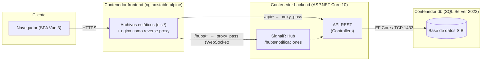
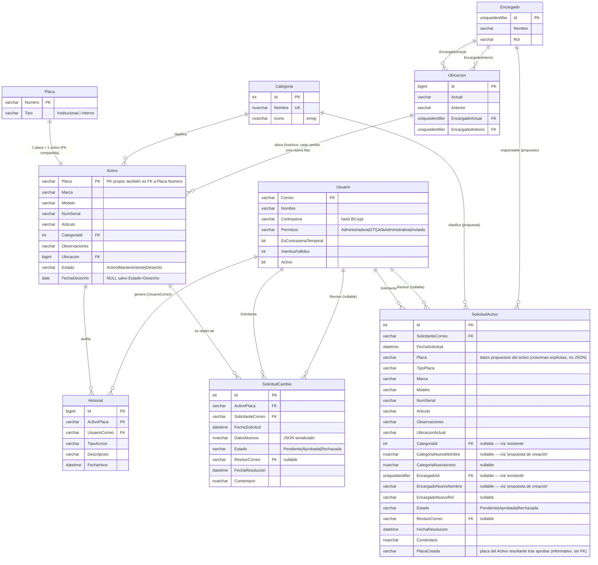
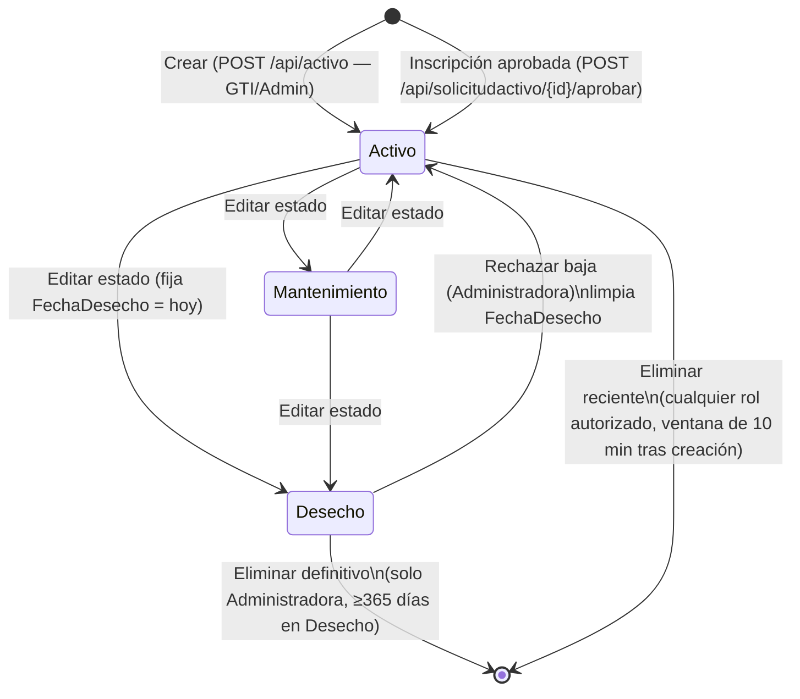
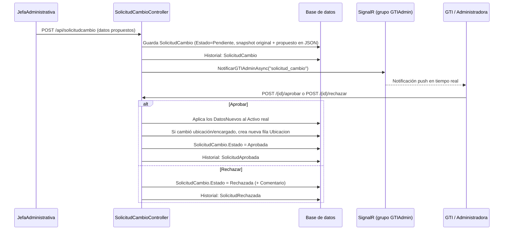
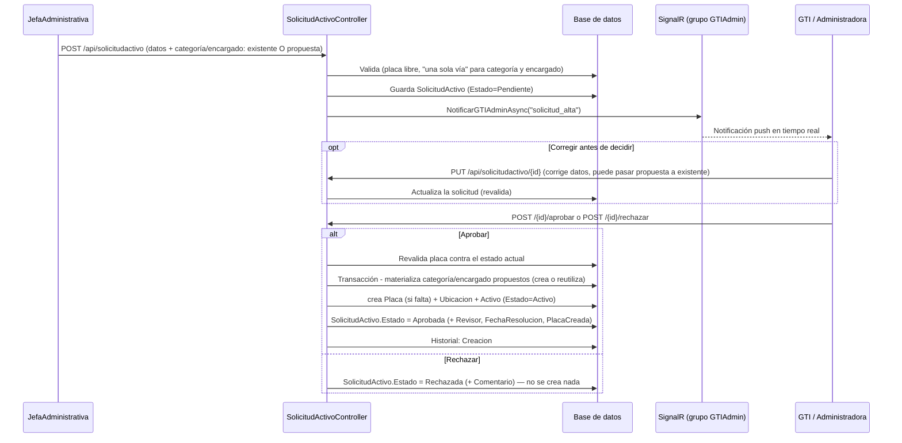

# Manual Técnico — SIBI (Sistema de Inventario de Bienes Institucionales)

**Escuela de Ingeniería Civil (EIC) — Universidad de Costa Rica**

Este documento existe para que cualquier desarrollador que no conozca el proyecto pueda leerlo, entender por qué está construido como está, y retomar el trabajo sin tener que hacer arqueología de código. Cubre arquitectura, backend, frontend, base de datos, seguridad, despliegue y flujos de negocio.

> Convención del proyecto: nombres de clases, propiedades, rutas y mensajes están en español, porque el dominio (bienes institucionales de una universidad costarricense) y sus usuarios son hispanohablantes. Este manual mantiene esa convención al referirse a entidades del código (`Activo`, `Encargado`, etc.) pero está escrito en español para que sea consistente con el resto del repositorio.

---

## Tabla de contenido

1. [Qué es SIBI](#1-qué-es-sibi)
2. [Arquitectura general](#2-arquitectura-general)
3. [Stack tecnológico](#3-stack-tecnológico)
4. [Estructura de carpetas](#4-estructura-de-carpetas)
5. [Modelo de datos y base de datos](#5-modelo-de-datos-y-base-de-datos)
6. [Backend (.NET)](#6-backend-net)
7. [Frontend (Vue 3)](#7-frontend-vue-3)
8. [Autenticación, autorización y seguridad](#8-autenticación-autorización-y-seguridad)
9. [Notificaciones en tiempo real (SignalR)](#9-notificaciones-en-tiempo-real-signalr)
10. [Despliegue con Docker Compose](#10-despliegue-con-docker-compose)
11. [Despliegue alternativo (frontend/backend separados, ej. Vercel)](#11-despliegue-alternativo-frontendbackend-separados-ej-vercel)
12. [Cómo levantar el proyecto en desarrollo local (sin Docker)](#12-cómo-levantar-el-proyecto-en-desarrollo-local-sin-docker)
13. [Flujos de negocio clave](#13-flujos-de-negocio-clave)
14. [Matriz de permisos por rol](#14-matriz-de-permisos-por-rol)
15. [Decisiones de diseño y por qué existen](#15-decisiones-de-diseño-y-por-qué-existen)
16. [Deuda técnica y limitaciones conocidas](#16-deuda-técnica-y-limitaciones-conocidas)
17. [Preguntas frecuentes y errores comunes](#17-preguntas-frecuentes-y-errores-comunes-troubleshooting)
18. [Dónde tocar el código para tareas comunes](#18-dónde-tocar-el-código-para-tareas-comunes)

---

## 1. Qué es SIBI

SIBI es el sistema interno de la EIC-UCR para llevar el inventario de bienes institucionales (computadoras, mobiliario, equipo de laboratorio, etc.), identificados por **placa**. Para cada bien se registra marca, modelo, número de serie, categoría, ubicación física, encargado responsable, estado (Activo / Mantenimiento / Desecho) y un historial completo de cambios (auditoría).

El sistema tiene cuatro roles con distinto nivel de permiso (ver [sección 14](#14-matriz-de-permisos-por-rol)):

- **Administradora**: control total (usuarios, categorías, eliminación definitiva de activos, aprobación de solicitudes de cambio y de inscripción de activos).
- **GTI** (Gestión de Tecnologías de Información): gestión operativa del inventario, encargados, aprobación/rechazo (y edición previa) de solicitudes de cambio y de inscripción de activos.
- **JefaAdministrativa**: no edita ni da de alta activos directamente; **propone** cambios sobre activos existentes mediante "solicitudes de cambio" y **propone el alta de activos nuevos, uno a uno**, mediante "solicitudes de inscripción" (`SolicitudActivo`). En ambos casos GTI/Administradora deben aprobar (pueden además corregir los datos antes de aprobar, o rechazar).
- **Invitado**: solo lectura. Puede ver el inventario, una vista rápida de cada activo (modal, al hacer clic en la tabla), categorías y la lista de Desecho (sin botones de acción), pero no la página de detalle completo de un activo ni el historial/auditoría (ver `requiresNoInvitado` en el router y el `v-if="!auth.esInvitado"` sobre el botón "ver detalle completo" en `ActivoModal.vue`).

Módulos funcionales (cada uno = una vista Vue + un controller en el backend):

| Módulo | Vista frontend | Controller backend |
|---|---|---|
| Login / recuperación / cambio de contraseña | `LoginView`, `RecuperarContrasenaView`, `CambiarContrasenaView` | `AuthController` |
| Dashboard con estadísticas | `DashboardView` | `ActivoController` (`/stats`, `/recientes`) |
| Inventario (listar/crear/editar/buscar activos) | `InventarioView`, `ActivoDetalleView`, `ActivoModal`, `ImportarActivosModal` | `ActivoController` |
| Categorías de activos | `CategoriasView` | `CategoriaController` |
| Encargados (personas responsables de bienes) | `EncargadosView` | `EncargadoController` |
| Desecho (baja de activos) | `DesechoView` | `DesechoController` |
| Historial / auditoría | `HistorialView` | `HistorialController` |
| Solicitudes de cambio y de inscripción de activos (flujos de aprobación) | `SolicitudesView`, `MisSolicitudesView`, `SolicitudAltaModal` | `SolicitudCambioController`, `SolicitudActivoController` |
| Usuarios del sistema | `UsuariosView` | `UsuarioController` |
| Notificaciones push en tiempo real | `stores/notificaciones.js` | `Hubs/NotificacionHub.cs` |

---

## 2. Arquitectura general

Aplicación de 3 capas clásica, cada una en su propio contenedor Docker:



Puntos clave de esta arquitectura:

- El **frontend nunca habla directo con el backend en producción**: nginx dentro del contenedor `frontend` actúa de reverse proxy para `/api/` y `/hubs/`, hacia el contenedor `backend` por la red interna de Docker (`sibi-net`). Esto evita problemas de CORS en producción y expone un solo puerto público.
- En **desarrollo**, el proxy lo hace `vue-cli-service` (ver `frontend/vue.config.js`, `devServer.proxy`) hacia `http://localhost:5025`.
- El backend expone Swagger solo en `Development` (`Program.cs`, `if (app.Environment.IsDevelopment())`).
- Hay un **servidor nginx del host** (fuera de Docker) descrito en `nginx/eic.sibi.ucr.ac.cr.conf`, que es el que finalmente recibe tráfico del dominio `eic.sibi.ucr.ac.cr` y lo reenvía al contenedor `frontend` (publicado en el puerto `8081` del host). Es decir, hay **dos niveles de nginx**: uno en el host (dominio, TLS terminado ahí presumiblemente por un proxy superior) y uno dentro del contenedor `frontend` (SPA + proxy interno hacia backend).

---

## 3. Stack tecnológico

### Backend
- **.NET 10** / ASP.NET Core Web API (`backend/backend.csproj`, `TargetFramework=net10.0`)
- **Entity Framework Core 10** con proveedor **SQL Server** (`Microsoft.EntityFrameworkCore.SqlServer`)
- **JWT Bearer** para autenticación (`Microsoft.AspNetCore.Authentication.JwtBearer`)
- **BCrypt.Net-Next** para hash de contraseñas
- **SignalR** para notificaciones push en tiempo real
- **Swashbuckle** (Swagger/OpenAPI) solo en desarrollo

### Frontend
- **Vue 3** (Options/Composition API mixtas) con **Vue CLI 5** (no Vite)
- **Pinia** para estado global (auth, notificaciones)
- **Vue Router 4** con guardas de navegación basadas en roles
- **Axios** para HTTP, con interceptores de token y logout automático en 401
- **@microsoft/signalr** cliente para el hub de notificaciones
- **Tailwind CSS 3** para estilos (utility-first, sin librería de componentes)
- **xlsx** (SheetJS) para importar/exportar Excel
- **jsPDF + jspdf-autotable** para exportar reportes en PDF

### Base de datos
- **SQL Server 2022** (imagen oficial `mcr.microsoft.com/mssql/server:2022-latest`, edición Express vía `MSSQL_PID`)

### Infraestructura
- **Docker Compose** orquesta 3 servicios: `db`, `backend`, `frontend`
- **nginx** como servidor web del frontend y como reverse proxy del host

---

## 4. Estructura de carpetas

```
SIBI/
├── .github/workflows/ci.yml     # CI: build de backend (.NET) y lint+build de frontend (Node), en paralelo
├── backend/                     # API .NET
│   ├── Controllers/              # 7 controllers REST (uno por recurso)
│   ├── DTOs/                     # Records de entrada/salida (nunca se exponen los Models directo)
│   ├── Data/SibiDbContext.cs     # Configuración de EF Core (Fluent API, no hay migraciones EF)
│   ├── Hubs/NotificacionHub.cs   # Hub SignalR
│   ├── Models/                   # Entidades EF (mapeadas 1:1 a tablas SQL existentes)
│   ├── Services/                 # AuthService, HistorialService, NotificacionService
│   ├── Program.cs                # Composition root: DI, JWT, CORS, SignalR, pipeline HTTP
│   ├── appsettings.json          # Config base (producción)
│   └── appsettings.Development.json
├── database/
│   ├── SIBI.sql                  # DDL completo (CREATE DATABASE + tablas + constraints)
│   ├── seed.sql                  # Placeholder — la cuenta admin ya se siembra en SIBI.sql, no se duplica aquí
│   ├── migrations/               # Migraciones idempotentes, ordenadas (NNN_nombre.sql)
│   │   ├── 001_categoria_nvarchar.sql   # VARCHAR→NVARCHAR en Categoria.Nombre/Icono
│   │   └── 002_solicitud_activo.sql     # Tabla SolicitudActivo + propuesta de categoría/encargado
│   ├── init.sh                   # Entrypoint del contenedor db: crea el esquema y aplica las migraciones pendientes
│   └── Dockerfile
├── frontend/                     # SPA Vue 3
│   ├── src/
│   │   ├── components/           # Componentes compartidos (modales, layout, selects)
│   │   ├── composables/          # useDialog.js (diálogo de confirmación global)
│   │   ├── router/index.js       # Rutas + guardas de navegación
│   │   ├── services/             # 1 archivo por recurso, wrapper delgado sobre axios
│   │   ├── stores/                # Pinia: auth.js, notificaciones.js
│   │   ├── utils/emojiGrupos.js  # Paleta de emojis para íconos de categoría
│   │   └── views/                # 1 vista por ruta/módulo
│   ├── nginx.conf                # Config de nginx DENTRO del contenedor frontend
│   └── Dockerfile
├── nginx/eic.sibi.ucr.ac.cr.conf # Config de referencia para el nginx del SERVIDOR (host), no se usa en Docker
├── tools/HashGenerator/           # Consola .NET para generar hashes BCrypt manualmente (setup inicial)
├── docker-compose.yml             # Orquesta db + backend + frontend
└── .env.example                   # Plantilla de variables de entorno para docker compose
```

---

## 5. Modelo de datos y base de datos

### 5.1 Diagrama entidad-relación



### 5.2 Particularidades importantes del esquema

1. **`Activo.Placa` es simultáneamente la PK de `Activo` y una FK a `Placa.Numero`.** Es decir, cada bien tiene exactamente una fila en `Placa` (que solo guarda el tipo: Institucional/Interno) y una fila en `Activo` (todo lo demás). Esto permite **cambiar la placa de un activo** sin perder historial: `ActivoController.CambiarPlaca` crea una fila `Placa` + `Activo` nuevas, re-apunta `Historial` y `SolicitudCambio` a la nueva placa, y borra las filas viejas — todo dentro de una transacción (ver `backend/Controllers/ActivoController.cs`, método `CambiarPlaca`).

2. **`Ubicacion` es un histórico append-only, no se edita in-place.** Cada vez que cambia la ubicación física o el encargado de un activo, se inserta una **fila nueva** en `Ubicacion` (con `Anterior` apuntando a los valores previos) y el `Activo.Ubicacion` se re-apunta a esa fila nueva. La fila vieja **no se borra** (queda huérfana de `Activo` pero conserva su historia). Esto es lo que permite mostrar "ubicación anterior / encargado anterior" en el detalle de un activo sin necesidad de una tabla de auditoría aparte para movimientos.

3. **`Historial` es la tabla de auditoría central.** Toda mutación relevante de un `Activo` pasa por `HistorialService.RegistrarAsync(...)`, que inserta una fila con un `TipoAccion` restringido por CHECK constraint a un enum fijo: `Creacion, CambioUbicacion, CambioEncargado, CambioEstado, CambioPlaca, Eliminacion, Aprobacion, Rechazo, SolicitudCambio, SolicitudAprobada, SolicitudRechazada`. **No hay triggers de SQL**: la auditoría es 100% responsabilidad del backend (ver comentario en `SIBI.sql`: "gestionado desde el backend, no con triggers"). Si se agrega un endpoint nuevo que muta un `Activo`, hay que acordarse de llamar `HistorialService` explícitamente y, si el `TipoAccion` es nuevo, **agregar el valor al CHECK constraint** (`CHK_Historial_TipoAccion`) en la base de datos.

4. **`SolicitudCambio.DatosNuevos` es JSON libre**, deserializado como `SolicitudDatosDto` (ver `backend/DTOs/SolicitudCambioDto.cs`). Guarda tanto los valores propuestos como un **snapshot de los valores originales** (`MarcaOriginal`, `ModeloOriginal`, etc.) tomado en el momento de crear la solicitud, para que la UI pueda mostrar un diff "antes/después" aunque el activo haya cambiado entre tanto.

   **`SolicitudActivo` es distinta**: como el activo aún no existe, no puede tener una FK a `Activo`, así que guarda los datos propuestos en **columnas explícitas y tipadas**, no en JSON. Tiene FK **anulable** a `Categoria` y `Encargado`, y FK a `Usuario` (solicitante/revisor).

   La categoría y el encargado se guardan de **una de dos formas mutuamente excluyentes** (CHECK constraints `CHK_SolicitudActivo_Categoria` / `CHK_SolicitudActivo_Encargado_Via`, "exactamente una vía"):
   - **existente**: `CategoriaId` / `EncargadoId` apuntan a una fila real; o
   - **propuesta de creación**: `CategoriaNuevaNombre` (+ `CategoriaNuevaIcono`) / `EncargadoNuevoNombre` + `EncargadoNuevoRol` describen algo que **todavía no existe**. La Jefa puede proponerlo desde el mismo formulario de "Inscribir Activo".

   Al aprobar, `SolicitudActivoController.Aprobar` corre una transacción que **primero materializa** la categoría y el encargado propuestos (`ResolverCategoriaAsync` / `ResolverEncargadoAsync` — crean la fila, o reutilizan una existente si el nombre ya coincide ahora) y **luego** hace lo mismo que `POST /api/activo` (crea `Placa` si no existe + `Ubicacion` + `Activo`, `Historial` tipo `Creacion`), marca la solicitud `Aprobada` y copia la placa creada en `PlacaCreada` (columna informativa, **sin FK**, para que el activo se pueda borrar después sin arrastrar la solicitud). Antes de crear nada revalida que la placa no exista ya en `Activo` ni en otra `SolicitudActivo` pendiente. **Rechazar** no crea nada (ni activo, ni categoría, ni encargado). GTI/Administradora pueden editar los datos propuestos —incluido cambiar una propuesta por una entrada existente, o al revés— con `PUT /api/solicitudactivo/{id}` mientras esté `Pendiente`.

5. **Reglas de negocio impuestas por CHECK constraints** (documentadas en `database/SIBI.sql`):
   - `CHK_Usuario_Correo`: solo se permiten correos que terminen en `@ucr.ac.cr`.
   - `CHK_Usuario_Permisos`: el rol debe ser uno de los 4 válidos (Invitado, JefaAdministrativa, GTI, Administradora).
   - `CHK_Placa_Tipo`: `Institucional` o `Interno`.
   - `CHK_Activo_Estado`: `Activo`, `Mantenimiento` o `Desecho`.
   - `CHK_Activo_FechaDesecho`: `FechaDesecho` **debe** tener valor si y solo si `Estado = 'Desecho'` (constraint compuesta, no dos columnas independientes).

6. **No se usan EF Core Migrations.** El esquema vive en scripts SQL planos: `SIBI.sql` (DDL completo, al día) + `database/migrations/NNN_*.sql` (migraciones **idempotentes y ordenadas**). `database/init.sh` los aplica al arrancar el contenedor `db`, llevando registro en la tabla `SchemaMigracion` (cada archivo se aplica una sola vez). Para un cambio de esquema futuro: **agregar `database/migrations/NNN_descripcion.sql` idempotente** (guardas `IF ... EXISTS`, un lote `GO` por statement que dependa de otro previo) y reflejar el cambio en `SIBI.sql` y en `Models`/`SibiDbContext`. No usar `dotnet ef migrations add`. El `Dockerfile` copia toda la carpeta `migrations/`, así que no hay que tocarlo por cada script nuevo.

### 5.3 Orden de arranque de la base de datos (`database/init.sh`)

1. Levanta `sqlservr` en background y espera a que responda `sqlcmd -Q "SELECT 1"` (hasta 30 reintentos).
2. Si la base `SIBI` **no existe**: ejecuta `SIBI.sql` (crea la BD + todo el esquema al día) y luego `seed.sql`.
3. **Siempre** (fresh o existente): crea `SchemaMigracion` si falta y recorre `database/migrations/*.sql` en orden; aplica los que no estén registrados y los inserta en `SchemaMigracion`. En un fresh son no-ops (el esquema ya viene completo en `SIBI.sql`) que solo quedan registrados; en una base vieja, actualizan el esquema.
4. Los datos persisten en el volumen Docker `mssql-data` entre reinicios.

`SIBI.sql` termina con el `INSERT` que crea la cuenta `soporte.eic@ucr.ac.cr` directamente con su contraseña fija definitiva (hash BCrypt) y `EsContrasenaTemporal = 0` — no es una contraseña temporal de fábrica, es la contraseña permanente de esa cuenta desde el primer arranque (ver [sección 8](#8-autenticación-autorización-y-seguridad) sobre por qué esta cuenta no puede cambiar su contraseña desde la aplicación). `seed.sql` ya no inserta nada: es solo un comentario recordando que esa cuenta se siembra en `SIBI.sql` y no debe duplicarse ahí.

Para generar un hash nuevo (por ejemplo, si se decide rotar la contraseña fija):

```bash
cd tools/HashGenerator
dotnet run "MiContrasenaNueva123!"
# Copiar el hash $2a$11$... resultante y pegarlo en el INSERT de database/SIBI.sql
```

---

## 6. Backend (.NET)

### 6.1 Composition root (`backend/Program.cs`)

Es un backend minimal-hosting (top-level statements, sin `Startup.cs`). En orden:

1. Registra controllers, Swagger (con soporte de Bearer token en la UI), y `SibiDbContext` apuntando a `ConnectionStrings:SIBI`.
2. Lee `Jwt:Key` de configuración; **si está vacía, lanza excepción al arrancar** (`InvalidOperationException`) — esto es intencional, para no correr nunca con un JWT sin firmar correctamente.
3. Configura JWT Bearer: valida issuer, lifetime y firma; **no valida audience**. Tiene un hook especial (`OnMessageReceived`) para leer el token desde el **query string** (`?access_token=...`) cuando la petición es a `/hubs/*`, porque las conexiones WebSocket de SignalR no siempre pueden mandar el header `Authorization`.
4. CORS: política `FrontendVue`. En `Development` permite **cualquier origen** (`SetIsOriginAllowed(_ => true)`); en producción, `https://eic.sibi.ucr.ac.cr` y `http://eic.sibi.ucr.ac.cr` (ambos esquemas explícitamente permitidos).
5. Registra SignalR y los tres servicios de aplicación (`AuthService`, `HistorialService`, `NotificacionService`) como `Scoped`.
6. Pipeline HTTP: Swagger (solo dev) → `UseForwardedHeaders` (para que el backend vea la IP/proto real detrás de los proxies nginx) → CORS → Auth → Controllers → Hub.

### 6.2 Controllers

Todos los controllers heredan de `ControllerBase`, usan `[ApiController]` + `[Route("api/[controller]")]`, y devuelven DTOs (nunca entidades EF directamente, para no filtrar campos internos ni crear ciclos de serialización por las navigation properties).

| Controller | Ruta base | Autorización por defecto | Notas |
|---|---|---|---|
| `AuthController` | `/api/auth` | Anónimo (excepto `cambiar-contrasena`) | Login, cambio de contraseña (no expone recuperación — endpoint eliminado, ver [16](#16-deuda-técnica-y-limitaciones-conocidas)) |
| `ActivoController` | `/api/activo` | `[Authorize]` en la clase, roles específicos por acción | CRUD de activos, importación masiva, cambio de placa. `POST /api/activo` y `POST /api/activo/importar` son ahora solo `GTI,Administradora` (la `JefaAdministrativa` ya **no** crea ni importa; usa `SolicitudActivoController`) |
| `CategoriaController` | `/api/categoria` | Lectura para cualquier autenticado, escritura solo `Administradora` | |
| `EncargadoController` | `/api/encargado` | `[Authorize]` en la clase | Incluye reasignación masiva de activos |
| `DesechoController` | `/api/desecho` | `[Authorize]` en la clase, aprobar/rechazar solo `Administradora` | |
| `HistorialController` | `/api/historial` | `Roles = "GTI,Administradora,JefaAdministrativa"` (Invitado no ve historial) | Filtrable por usuario, placa, tipo de acción, rango de fechas |
| `SolicitudCambioController` | `/api/solicitudcambio` | Depende del endpoint | Flujo de aprobación de **cambios** a activos existentes (ver [13.3](#133-flujo-de-solicitudes-de-cambio)) |
| `SolicitudActivoController` | `/api/solicitudactivo` | Depende del endpoint | Flujo de aprobación de **altas** de activos nuevos ("inscripción", ver [13.6](#136-flujo-de-inscripción-de-activos-solicitud-de-alta)) |
| `UsuarioController` | `/api/usuario` | `Roles = "Administradora"` en toda la clase | Gestión de cuentas |

Detalles de endpoints no obvios en `ActivoController` (el controller más grande y con más lógica transaccional):

- `GET /api/activo`: paginado (`pagina`, `tamano`), con filtros por texto libre (`busqueda`, sobre Placa/Marca/Modelo/NumSerial/Articulo), `categoriaIds[]` y `estado`. La fecha de creación de cada activo **no está en la tabla `Activo`**; se resuelve consultando el `Historial` por la primera fila `TipoAccion = 'Creacion'` de cada placa (batch, no N+1).
- `GET /api/activo/stats`: cuenta activos por estado y por categoría, usado por el Dashboard.
- `POST /api/activo`: transacción que crea `Placa` (si no existe) + `Ubicacion` + `Activo`, y registra `Historial` tipo `Creacion`. Roles: `GTI, Administradora` (la `JefaAdministrativa` fue removida — ahora inscribe activos vía `POST /api/solicitudactivo`, ver [13.6](#136-flujo-de-inscripción-de-activos-solicitud-de-alta)).
- `POST /api/activo/importar`: importación masiva desde Excel (el parseo del `.xlsx` ocurre en el **frontend** con SheetJS; el backend solo recibe un array de filas ya parseadas). Procesa fila por fila, **cada fila en su propia transacción** (si una fila falla no revierte las demás), y traduce mensajes de error de SQL Server (constraint violations) a mensajes en español legibles para el usuario (ver el bloque `catch` largo con `detalle.Contains(...)`). Roles: `GTI, Administradora` (la `JefaAdministrativa` puede descargar la plantilla desde `InventarioView`, pero **no** subirla).
- `PUT /api/activo/{placa}`: si cambia ubicación o encargado, crea una nueva fila `Ubicacion` (nunca edita la existente) y registra `Historial` separado para cada tipo de cambio (ubicación, encargado, estado) — puede generar hasta 3 filas de historial en una sola edición.
- `PATCH /api/activo/{placa}/cambiar-placa`: ver [5.2](#52-particularidades-importantes-del-esquema) punto 1.
- `DELETE /api/activo/{placa}/reciente`: permite borrar un activo **recién creado** (ventana de 10 minutos desde su `Historial` tipo `Creacion`), pensado como "deshacer" rápido de un error de captura. Pasado ese tiempo, retorna `400`.
- `DELETE /api/activo/{placa}`: eliminación **definitiva**, solo `Administradora`, y solo si el activo lleva **al menos 365 días** en estado `Desecho` (`hoy.DayNumber - activo.FechaDesecho.Value.DayNumber < 365` → rechazo). Borra en cascada manual: `Historial`, `SolicitudCambio`, `Activo`, `Placa`, `Ubicacion` (en ese orden, porque EF no tiene `ON DELETE CASCADE` configurado — todas las FK son `DeleteBehavior.Restrict`).
- `GET /api/activo/recientes`: activos creados más recientemente **dentro de una categoría**, usado en el Dashboard.
- `GET /api/activo/{placa}/desecho-info`: resuelve **quién envió el activo a Desecho** y cómo. Busca primero una `SolicitudCambio` con `Estado = "Aprobada"` cuyo `DatosNuevos.Estado` sea `"Desecho"` (devuelve `tipo: "solicitud"` con el nombre de quien la solicitó y quien la aprobó); si no encuentra una, busca en `Historial` la entrada `CambioEstado` más reciente cuya descripción contenga "Desecho" (devuelve `tipo: "directo"` con quien lo hizo). Devuelve `204 No Content` si el activo no está en Desecho o no hay información. El endpoint en sí no tiene restricción de rol (cualquier autenticado puede llamarlo), pero el **frontend oculta el resultado a `Invitado`** en los tres lugares donde se usa (`v-if="desechoInfo && !auth.esInvitado"` en `ActivoModal.vue`, `ActivoDetalleView.vue` y `DesechoView.vue`) — es decir, `DesechoController.Listar` (que resuelve lo mismo en lote para toda la lista, campo `desechoInfo` en cada item) sigue devolviendo el dato en el JSON para Invitado, solo que la UI no lo pinta.

Endpoints de `SolicitudActivoController` (`/api/solicitudactivo` — flujo de inscripción de activos):

- `POST /api/solicitudactivo` (`JefaAdministrativa`): crea una `SolicitudActivo` en estado `Pendiente`. `ValidarDatosAsync` exige, para la categoría, **exactamente una vía**: `CategoriaId` de una fila existente **o** `CategoriaNuevaNombre` (propuesta que aún no exista con ese nombre); idem para el encargado con `EncargadoId` vs. `EncargadoNuevoNombre`+`EncargadoNuevoRol`. Además valida placa/`TipoPlaca`/obligatorios y que la placa no esté tomada en `Activo` ni en otra solicitud pendiente. Notifica a `GTIAdmin` (`solicitud_alta`). **No** escribe `Historial` todavía.
- `GET /api/solicitudactivo?estado=` (`GTI,Administradora`): lista todas, filtrable por estado.
- `GET /api/solicitudactivo/mis?estado=` (`JefaAdministrativa`): lista las propias.
- `GET /api/solicitudactivo/pendientes/count` (`GTI,Administradora`): contador para el badge del menú.
- `PUT /api/solicitudactivo/{id}` (`GTI,Administradora`): corrige los datos propuestos mientras esté `Pendiente` — incluye poder cambiar la vía (propuesta ↔ existente). Misma validación que el POST.
- `POST /api/solicitudactivo/{id}/aprobar` (`GTI,Administradora`): revalida contra el estado actual (`enAprobacion: true` — no rechaza si la categoría/encargado propuesto ya existe, se reutiliza), y en una transacción: **1)** `ResolverCategoriaAsync` / `ResolverEncargadoAsync` materializan las propuestas (crean o reutilizan la fila), **2)** crea `Placa` (si falta) + `Ubicacion` + `Activo` (estado `Activo`), marca la solicitud `Aprobada` (+ `RevisorCorreo`, `FechaResolucion`, `PlacaCreada`) y registra `Historial` tipo `Creacion` (descripción capada a 250 chars; menciona lo creado además del activo).
- `POST /api/solicitudactivo/{id}/rechazar` (`GTI,Administradora`): marca `Rechazada` + `Comentario` (reutiliza `RechazarSolicitudRequest`). No crea nada — tampoco la categoría/encargado propuestos.

### 6.3 DTOs

Están en `backend/DTOs/`, son `record`s inmutables de C#. Un patrón consistente: por cada recurso hay un DTO de **salida** (ej. `ActivoDto`) y uno o más de **entrada** (`CrearActivoRequest`, `EditarActivoRequest`). Esto desacopla el contrato HTTP de las entidades EF, así que renombrar una columna de base de datos no rompe el frontend mientras se mantenga el DTO. El flujo de inscripción usa `SolicitudActivoRequest` (entrada, compartido por crear/editar) y `SolicitudActivoDto` (salida) en `backend/DTOs/SolicitudActivoDto.cs`. Ambos llevan, además de los campos del activo, los pares **existente vs. propuesta** para categoría (`CategoriaId` / `CategoriaNuevaNombre` + `CategoriaNuevaIcono`) y encargado (`EncargadoId` / `EncargadoNuevoNombre` + `EncargadoNuevoRol`); el DTO de salida resuelve además `CategoriaNombre` / `EncargadoNombre` (vacíos si es propuesta) y `SolicitanteNombre` / `RevisorNombre`.

### 6.4 Servicios

- **`AuthService`**: login (con bloqueo tras 3 intentos fallidos y notificación a admins cuando eso ocurre — `soporte.eic@ucr.ac.cr` está exenta de este bloqueo, ver [sección 8](#8-autenticación-autorización-y-seguridad)), cambio de contraseña (valida fuerza: mínimo 6 caracteres, mayúscula, minúscula, número), y generación del JWT. Ya no expone recuperación de contraseña (`RecuperarContrasenaAsync` fue eliminado).
- **`HistorialService`**: un único método `RegistrarAsync`, usado por todos los controllers que mutan un `Activo`.
- **`NotificacionService`**: envía eventos SignalR a grupos de conexión (`GTIAdmin`, `Admin`) — ver [sección 9](#9-notificaciones-en-tiempo-real-signalr).

### 6.5 Generación de contraseñas temporales

`UsuarioController.GenerarContrasenaTemp` genera una contraseña de 8 caracteres garantizando al menos una mayúscula, una minúscula y un dígito, usando `System.Random` (no criptográficamente seguro, pero aceptable para una contraseña de un solo uso que se descarta al primer login — ver [16](#16-deuda-técnica-y-limitaciones-conocidas)).

---

## 7. Frontend (Vue 3)

### 7.1 Arranque y configuración

`src/main.js` crea la app, instala Pinia y el router, e importa `assets/tailwind.css`. No hay SSR ni Vite: el build lo hace `@vue/cli-service` (`vue.config.js`). En desarrollo, `devServer.proxy` reenvía `/api` y `/hubs` (con soporte WebSocket, `ws: true`) hacia `http://localhost:5025`, el puerto por defecto del backend en local (ver `backend/Properties/launchSettings.json`).

Alias `@` → `src/` configurado en `jsconfig.json` y usado en todos los imports.

### 7.2 Router (`src/router/index.js`)

Rutas planas para Login/Recuperar/Cambiar contraseña, y un grupo anidado bajo `AppLayout.vue` (el sidebar + topbar) para todo lo que requiere sesión. El guard global `router.beforeEach` implementa, en este orden:

1. Si la ruta requiere auth y no hay sesión → redirige a `Login`.
2. Si el usuario tiene `esContrasenaTemporal = true` → lo fuerza a `CambiarContrasena` sin importar a dónde iba (excepto si ya iba ahí). Esto es lo que obliga a cambiar la contraseña temporal en el primer login.
3. Si ya está autenticado (y no tiene contraseña temporal) e intenta ir a Login/Recuperar → lo manda al Dashboard.
4. Chequeos de rol vía `meta`: `requiresAdmin`, `requiresGTIorAdmin`, `requiresNoInvitado`.

Estos `meta` flags son la **única** barrera de UI para ocultar rutas por rol; el backend vuelve a validar todo con `[Authorize(Roles = ...)]`, así que el frontend nunca es la única línea de defensa (correcto: nunca confiar solo en el cliente).

### 7.3 Estado global (Pinia)

- **`stores/auth.js`**: guarda `token` y `usuario` (ambos persistidos en `localStorage` bajo las claves `sibi_token` / `sibi_usuario`). Expone getters de conveniencia por rol (`esAdministradora`, `esGTI` — que incluye Administradora, `esJefaAdministrativa`, `esInvitado`) usados tanto por el router como por las vistas para mostrar/ocultar UI.
- **`stores/notificaciones.js`**: mantiene la conexión SignalR y la lista de notificaciones recibidas en memoria (no persiste en `localStorage`; si se recarga la página se pierden las notificaciones ya mostradas, solo llegan las nuevas mientras la conexión esté viva). `AppLayout.vue` solo llama `notifStore.conectar(...)` cuando `auth.esGTI` es verdadero (GTI o Administradora) — `JefaAdministrativa` e `Invitado` nunca abren conexión SignalR ni reciben push en tiempo real; deben revisar sus pantallas manualmente para ver cambios de estado.

### 7.4 Capa de servicios (`src/services/`)

Cada archivo es un wrapper 1:1 sobre un controller del backend (mismo nombre de recurso). Ej.: `solicitudService.js` → `SolicitudCambioController`, `solicitudActivoService.js` → `SolicitudActivoController` (`crear` / `listar` / `listarMias` / `contarPendientes` / `editar` / `aprobar` / `rechazar`). `api.js` centraliza:
- La `baseURL` (usa `VUE_APP_API_URL` si está definida — deployment separado — o `/api` relativo — mismo origen, proxeado por nginx).
- Un serializador de query params custom que **omite valores vacíos/null** y expande arrays repitiendo la clave (`categoriaIds=1&categoriaIds=2`), porque el binding de ASP.NET Core para `int[]?` espera ese formato.
- Interceptor de request: agrega `Authorization: Bearer <token>` desde `localStorage`.
- Interceptor de response: en un `401` (salvo que la petición sea a `/auth/*`, para no interferir con el propio login fallido) limpia la sesión y fuerza `window.location.href = '/'` — logout duro, no solo redirect de Vue Router, para asegurar que se limpie todo el estado de la SPA.

### 7.5 Vistas y componentes

| Archivo | Responsabilidad |
|---|---|
| `AppLayout.vue` | Sidebar de navegación (ítems condicionados por rol, más un ítem "Manual" → `/manual` visible para **todos** los roles al final del menú), topbar con buscador global de activos (autocompletado con debounce), badge de solicitudes pendientes y panel de notificaciones (ambos solo para `esGTI`), y un modal de **cambio de contraseña voluntario** accesible desde el menú de perfil para cualquier rol autenticado — a diferencia de `CambiarContrasenaView` (solo para el primer login con contraseña temporal), este sí exige la contraseña actual. El badge y el panel de la campana combinan pendientes de **cambio** + de **inscripción**: el badge suma `solicitudService.contarPendientes()` + `solicitudActivoService.contarPendientes()`, y al abrir la campana `toggleNotif()` mezcla `solicitudService.listar('Pendiente')` + `solicitudActivoService.listar('Pendiente')` en una sola lista ordenada por fecha, con etiqueta "Cambio" / "Inscripción" por fila (los avisos push en tiempo real de tipo `solicitud_alta` también tienen su ícono en la sección "Recientes") |
| `ActivoModal.vue` | Modal grande (~1050 líneas) para crear/ver/editar un activo; incluye creación rápida de categoría (solo `Administradora`) o encargado (GTI/Administradora/JefaAdministrativa) sin salir del modal, banner de solicitud de cambio pendiente, banner de "Responsable del desecho" (vía `GET /api/activo/{placa}/desecho-info`, oculto para `Invitado`) cuando el activo está en estado Desecho, botón directo **"Enviar a Desecho"** para `esGTI` (edición inmediata, sin aprobación), y botones separados **"Solicitar Cambio"** / **"Solicitar Desecho"** para `esJefaAdministrativa`. En modo `create` con `esJefaAdministrativa` (`esSolicitudAlta = mode==='create' && esJefaAdministrativa`) el modal se titula **"Inscribir Activo"** y el submit va a `POST /api/solicitudactivo` (payload de `solicitudAltaPayload()`) en vez de `POST /api/activo`, emitiendo `saved('solicitud-alta')`. En ese modo los botones "Nueva categoría"/"Nuevo encargado" **proponen** en vez de crear: guardan la propuesta en `categoriaPropuesta`/`encargadoPropuesta` con los sentinelas `__cat_propuesta__` / `__enc_propuesta__` como valor del `SearchableSelect`, y `solicitudAltaPayload()` los traduce a `categoriaNuevaNombre` / `encargadoNuevoNombre`+`encargadoNuevoRol` |
| `SolicitudAltaModal.vue` | Modal de revisión de una solicitud de inscripción, para `GTI,Administradora`. Formulario con **todos** los campos del activo propuesto editables y tres acciones: **Guardar cambios** (`PUT /api/solicitudactivo/{id}`), **Rechazar** (con comentario inline) y **Aprobar y registrar** (persiste primero las correcciones si las hay, luego `POST .../aprobar`). Para categoría y encargado hay un toggle **Existente / Nueva (a crear)**: "Existente" muestra el `SearchableSelect`, "Nueva" muestra inputs de nombre (+ icono / + rol) y el `payload()` manda `categoriaNuevaNombre` / `encargadoNuevoNombre`. Un banner ámbar arriba lista lo que la inscripción propone crear |
| `ImportarActivosModal.vue` | Flujo de importación masiva: descarga plantilla `.xlsx`, acepta subir `.xlsx`, `.xls` o `.csv` (parseado con SheetJS en el navegador, como texto para CSV y como buffer binario para Excel), valida localmente, y manda las filas ya parseadas a `POST /api/activo/importar`. La creación de categorías nuevas durante el asistente está gateada por `puedeCrearCategorias = auth.esAdministradora` (ver [13.5](#135-importación-masiva-desde-excelcsv)) |
| `SearchableSelect.vue` | Combobox genérico con búsqueda, reusado para seleccionar categoría/encargado en varios formularios |
| `AppDialog.vue` + `composables/useDialog.js` | Reemplazo de `window.confirm`/`alert` nativo: un diálogo modal único (estado singleton reactivo) invocado como `useDialog().confirm({...})` que retorna una `Promise<boolean>` |
| `DashboardView.vue` | KPIs (tarjetas clicables que navegan a otras vistas) + gráficos por categoría; el contenido varía según rol (GTI ve tarjeta de Encargados, JefaAdministrativa ve tarjeta **"Solicitudes Pendientes"** que cuenta sus solicitudes de cambio **+** de inscripción pendientes y enlaza a `/mis-solicitudes`; Invitado ve una tarjeta de Mantenimiento) |
| `InventarioView.vue` | Tabla paginada/filtrable de activos, punto de entrada a `ActivoModal`; botones "Excel" y "PDF" (exportación con SheetJS/jsPDF, visibles para `esGTI \|\| esJefaAdministrativa` — `esGTI` ya incluye Administradora). "Importar Excel" solo para `esGTI \|\| esAdministradora`. El botón de alta individual se muestra para `esGTI \|\| esAdministradora \|\| esJefaAdministrativa`: para la Jefa se rotula **"Inscribir Activo"** y su envío pasa por el flujo de solicitud de inscripción (no crea el activo directamente). Para `esJefaAdministrativa` sigue existiendo el botón propio "Plantilla Excel" que abre un modal informativo (sin asistente de carga) con un botón "Descargar plantilla (.xlsx)" — genera el archivo con una función local (`descargarPlantilla()`) que **duplica** la lógica de plantilla de `ImportarActivosModal.vue` en vez de reutilizarla |
| `CategoriasView.vue` | Grid de categorías; al hacer clic en una tarjeta (cualquier rol, incluyendo Invitado) despliega un panel inline con los activos de esa categoría, reutilizando `ActivoModal` en modo `view` |
| `EncargadosView.vue` | Grid de encargados con panel inline de sus activos; el modal "Editar Encargado" incluye una tabla de activos con checkboxes para **reasignación en bloque** (selecciona activos → elige encargado destino en un `<select>` → botón "Aplicar"), sin pantalla aparte |
| `DesechoView.vue` | Lista de activos en Desecho con barra de progreso hacia los 365 días, banner de "Responsable del desecho" (oculto para `Invitado`), botón "Imprimir PDF" (reporte, visible a cualquier rol con acceso a la vista) y acciones "Aprobar Eliminación"/"Recuperar" solo para `esAdministradora`, con doble confirmación (incluye una animación "shake") antes de borrar definitivamente |
| `ManualView.vue` | Vista nueva en `/manual`, en el sidebar para **todos los roles** (ítem "Manual" al final de `navItems`, sin restricción). Muestra el rol activo y una lista de "capacidades" **hardcodeada en un objeto JS** (`capacidadesPorRol`) — texto de resumen por rol que duplica, de forma independiente y ya desincronizable, el contenido de los manuales en `manuales-usuario/` (ver nota en [15](#15-decisiones-de-diseño-y-por-qué-existen)/[16](#16-deuda-técnica-y-limitaciones-conocidas)). Debajo lista los 5 manuales (`Administradora`, `GTI`, `Jefa Administrativa`, `Invitado`, `Técnico`) filtrados por rol (`todosLosManuales`, cada uno con un array `roles` — el técnico solo a `Administradora`). Los 5 apuntan a los PDF en SharePoint institucional (`url` con la URL de compartir; abren en pestaña nueva). Los PDF fuente están en `manuales-usuario/pdf/` (generados con `manuales-usuario/pdf/build.js` + Chrome headless). |
| `SolicitudesView.vue` / `MisSolicitudesView.vue` | Bandeja de aprobación (GTI/Administradora) vs. bandeja de solicitudes propias (JefaAdministrativa). Un selector de **origen** en la parte superior alterna entre **"Inscripción de activos"** (`SolicitudActivo`, default) y **"Cambios a activos"** (`SolicitudCambio`), cada uno con su propio contador de pendientes; debajo, las mismas pestañas Pendiente/Aprobada/Rechazada. En "Inscripción", `SolicitudesView` abre `SolicitudAltaModal` con el botón "Revisar"; `MisSolicitudesView` solo muestra el estado. Las solicitudes de cambio cuyo `datosNuevos.estado === 'Desecho'` se distinguen con badge/borde rojo "Desecho" y una vista simplificada ("Activo a desechar", sin comparación campo a campo) |
| `RecuperarContrasenaView.vue` | **No es autoservicio.** Es una página estática que muestra un enlace `mailto:soporte.eic@ucr.ac.cr` e indica contactar a un administrador o al equipo de GTI. El endpoint que en algún momento hubiera podido usar (`POST /api/auth/recuperar`) fue **eliminado del backend** por no tener ningún cliente; `authService.js` todavía tiene un método `recuperar()` apuntando ahí, pero es código muerto que nadie invoca (ver [16](#16-deuda-técnica-y-limitaciones-conocidas)) |

`utils/emojiGrupos.js` es simplemente un catálogo de emojis agrupados por temática, usado como selector de ícono al crear una categoría (el campo `Categoria.Icono` guarda el emoji tal cual, como texto Unicode).

---

## 8. Autenticación, autorización y seguridad

- **JWT firmado con HMAC-SHA256**, clave simétrica en `Jwt:Key` (variable de entorno `Jwt__Key` en producción). Claims: `NameIdentifier` = correo, `Name` = nombre, `Role` = permisos. Expira según `Jwt:ExpireHours` (8 horas por defecto).
- **Contraseñas**: hasheadas con BCrypt (`work factor` por defecto de la librería; `tools/HashGenerator` usa explícitamente `workFactor: 11`). Nunca se guardan ni se loguean en texto plano — excepto la contraseña temporal generada al crear, desbloquear o restablecer un usuario (`UsuarioController`), que se **devuelve una vez en la respuesta HTTP** para que un administrador la comunique manualmente (no hay envío de correo implementado, ver [16](#16-deuda-técnica-y-limitaciones-conocidas)).
- **Bloqueo de cuenta**: 3 intentos fallidos de login consecutivos bloquean la cuenta (`Usuario.IntentosFallidos >= 3`); se resetea a 0 en login exitoso. Un administrador debe llamar `POST /api/usuario/{correo}/desbloquear` para levantar el bloqueo (genera una nueva contraseña temporal de paso) — **excepto para `soporte.eic@ucr.ac.cr`**, ver punto siguiente.
- **Autorización por rol**: `[Authorize(Roles = "...")]` a nivel de acción o de clase en cada controller — es la fuente de verdad; el frontend solo oculta UI, no reemplaza esta validación.
- **CORS**: abierto en desarrollo, restringido a un origen fijo en producción (ver [6.1](#61-composition-root-backendprogramcs)).
- **Reglas de dominio de correo**: solo `@ucr.ac.cr` puede tener cuenta (`CHK_Usuario_Correo` en SQL + validación explícita en `UsuarioController.Crear`).
- **Cuenta de soporte protegida, con contraseña fija e inmutable desde la aplicación**: `soporte.eic@ucr.ac.cr` está hardcodeada en varios puntos del backend. En `UsuarioController`: no se puede eliminar, ni degradar de rol `Administradora`, ni **desactivar** (`Editar` rechaza `Activo = false` para ese correo con 400) — el campo "Estado" ni siquiera se muestra en su formulario de edición en `UsuariosView.vue`. Su contraseña **no puede modificarse por ninguna vía de la aplicación**: `AuthController.CambiarContrasena` la rechaza explícitamente con 400 (`"La contraseña de esta cuenta no puede modificarse desde la aplicación."`), y `UsuarioController.Desbloquear`/`ResetContrasena` hacen lo mismo. Además, `AuthService.LoginAsync` la exime por completo del mecanismo de bloqueo por intentos fallidos: nunca incrementa su `IntentosFallidos`, así que a diferencia de cualquier otra cuenta, **no puede llegar a bloquearse** sin importar cuántas veces se escriba mal la contraseña. `database/SIBI.sql` siembra esta cuenta con `EsContrasenaTemporal = 0` y un hash BCrypt fijo (la contraseña en texto plano correspondiente debe gestionarse fuera del repositorio, por ejemplo en un gestor de contraseñas del equipo). Es la cuenta de "no quedarse sin admin", y con estos cambios ese diseño ya no depende de que nunca acumule intentos fallidos.

---

## 9. Notificaciones en tiempo real (SignalR)

- Hub: `backend/Hubs/NotificacionHub.cs`, mapeado en `/hubs/notificaciones`, protegido con `[Authorize]`.
- Al conectar (`OnConnectedAsync`), el hub lee el claim de rol del usuario y lo agrega a grupos de SignalR: `GTIAdmin` (roles `GTI` y `Administradora`) y/o `Admin` (solo `Administradora`). No hay lógica de negocio en el hub más allá de esta agrupación — es puramente un canal de push.
- `NotificacionService.NotificarGTIAdminAsync` / `NotificarAdminAsync` son llamados desde los controllers cuando ocurre algo que ese grupo debe saber:
  - Nueva solicitud de cambio → notifica a `GTIAdmin` (`SolicitudCambioController.Crear`, evento `solicitud_cambio`).
  - Nueva solicitud de inscripción de activo → notifica a `GTIAdmin` (`SolicitudActivoController.Crear`, evento `solicitud_alta`).
  - Cuenta bloqueada por intentos fallidos → notifica a `Admin` (`AuthService.LoginAsync`).
- El cliente (`stores/notificaciones.js`) se conecta pasando el JWT como `accessTokenFactory`; como ya se explicó en [6.1](#61-composition-root-backendprogramcs), el backend intercepta ese token desde el query string porque el handshake de SignalR sobre WebSocket no siempre permite headers custom.
- Reconexión automática habilitada (`withAutomaticReconnect()`).

---

## 10. Despliegue con Docker Compose

`docker-compose.yml` define 3 servicios sobre una red bridge interna `sibi-net`:

| Servicio | Build context | Puertos publicados | Depende de |
|---|---|---|---|
| `db` | `./database` | ninguno (solo interno) | — |
| `backend` | `./backend` | ninguno (solo interno, puerto 8080) | `db` (con `condition: service_healthy`) |
| `frontend` | `./frontend` | `8081:80` | `backend` |

Es decir: **el único puerto expuesto al host es 8081** (el frontend). El backend y la base de datos solo son alcanzables entre contenedores. El healthcheck de `db` corre `sqlcmd -Q "SELECT 1"` cada 10s (hasta 15 reintentos, con 30s de gracia inicial) — el backend no arranca hasta que ese healthcheck pase. Ambos contenedores `db` y `backend` fijan `TZ: America/Costa_Rica`, para que las fechas registradas en `Historial.FechaHora`, `SolicitudCambio.FechaSolicitud`/`FechaResolucion` y `Activo.FechaDesecho` (base del conteo de 365 días para elegibilidad de eliminación) queden en hora local y no en UTC del contenedor.

**`docker-compose.override.yml`** (en la raíz, no committeado a producción) es fusionado automáticamente por Docker Compose cuando existe, y fuerza `ASPNETCORE_ENVIRONMENT: Development` + `AllowedHosts: "*"` sobre el contenedor `backend` — pensado para levantar el stack completo de Docker en una máquina de desarrollo sin heredar las restricciones de producción (CORS abierto, Swagger habilitado). En el servidor real, desplegar copiando solo `docker-compose.yml`, sin este archivo.

### 10.1 Variables de entorno requeridas

Copiar `.env.example` a `.env` (nunca commitear `.env`) y completar:

```
MSSQL_SA_PASSWORD=   # mín. 8 chars, mayúscula, minúscula, número y símbolo especial (requisito de SQL Server)
JWT_KEY=              # mín. 32 caracteres aleatorios — generar con: openssl rand -base64 48
```

Estas variables alimentan `ConnectionStrings__SIBI` y `Jwt__Key` del contenedor `backend` (la doble guion bajo `__` es la convención de ASP.NET Core para mapear variables de entorno a claves anidadas de configuración, equivalente a `Jwt:Key`).

### 10.2 Construcción de cada imagen

- **`backend/Dockerfile`**: build multi-stage — SDK de .NET 10 compila y publica (`dotnet publish -c Release`), la imagen final usa solo el runtime ASP.NET (más liviana, sin SDK). Expone 8080, arranca con `dotnet backend.dll`.
- **`frontend/Dockerfile`**: build multi-stage — Node 24 corre `npm ci && npm run build` (genera `dist/`), la imagen final es `nginx:stable-alpine` sirviendo esos estáticos con la config de `nginx.conf`.
- **`database/Dockerfile`**: parte de la imagen oficial de SQL Server, copia `SIBI.sql`, `seed.sql`, la carpeta `migrations/` e `init.sh` a `/docker-init/`, y usa `init.sh` como `ENTRYPOINT` (reemplaza el arranque por defecto para crear el esquema la primera vez y aplicar las migraciones pendientes en cada arranque). Tras cambiar el esquema, reconstruir la imagen: `docker compose up -d --build db` (el volumen `mssql-data` conserva los datos; las migraciones idempotentes se aplican al reiniciar).

### 10.3 Comandos operativos

```bash
# Primer arranque (o después de borrar el volumen)
docker compose up -d --build

# Ver logs de un servicio
docker compose logs -f backend

# Reconstruir solo el frontend tras un cambio de código
docker compose up -d --build frontend

# Bajar todo conservando datos (el volumen mssql-data persiste)
docker compose down

# Bajar todo Y borrar los datos de la base (irreversible)
docker compose down -v
```

### 10.4 nginx del servidor host

`nginx/eic.sibi.ucr.ac.cr.conf` **no se usa dentro de Docker**; es la config a instalar en el nginx del servidor físico/VM donde corre Docker, para que el dominio público `eic.sibi.ucr.ac.cr` llegue al contenedor `frontend` (puerto `8081` publicado en el host). El archivo trae en comentarios las instrucciones de instalación (`sites-available` / `sites-enabled`) y un `map` necesario para que el upgrade de conexión a WebSocket (usado por SignalR) funcione a través de este proxy también.

---

## 11. Despliegue alternativo (frontend/backend separados, ej. Vercel)

El historial de commits (`test for vercel`, `changes for vercel deployment`) muestra que el frontend se probó desplegado por separado (p. ej. en Vercel) apuntando a un backend alojado en otro lugar. Esto es posible gracias a que:

- `frontend/.env.development` y potencialmente un `.env` de build en Vercel definen `VUE_APP_API_URL` con la URL absoluta del backend; `api.js` y `stores/notificaciones.js` la usan como prefijo en vez de asumir mismo origen.
- `frontend/.env.production` la deja **vacía a propósito**, para el caso "todo en Docker" donde nginx proxea `/api` internamente.

Si se retoma este modo de despliegue: recordar que el CORS del backend en producción solo permite `https://eic.sibi.ucr.ac.cr` y `http://eic.sibi.ucr.ac.cr` como orígenes (`Program.cs`) — habría que agregar el dominio de Vercel a la política de CORS, o el navegador bloqueará las peticiones.

---

## 12. Cómo levantar el proyecto en desarrollo local (sin Docker)

### 12.1 Requisitos
- .NET SDK 10
- Node.js 20+ y npm
- SQL Server LocalDB (viene con Visual Studio) o cualquier instancia SQL Server accesible

### 12.2 Base de datos

```bash
# Con sqlcmd apuntando a tu instancia local:
sqlcmd -S "(localdb)\MSSQLLocalDB" -i database/SIBI.sql

# Migraciones idempotentes, en orden (todas se pueden re-correr sin daño):
for m in database/migrations/*.sql; do
  sqlcmd -S "(localdb)\MSSQLLocalDB" -d SIBI -b -i "$m"
done
```

En local no hace falta la tabla `SchemaMigracion` (ese registro lo lleva `init.sh` en Docker); como las migraciones son idempotentes, basta con correrlas todas.

`SIBI.sql` ya crea la cuenta `soporte.eic@ucr.ac.cr` con su contraseña fija de una vez (ver [5.3](#53-orden-de-arranque-de-la-base-de-datos-databaseinitsh)) — no hace falta ejecutar `database/seed.sql` para tener una cuenta con la que iniciar sesión en local; ese archivo hoy no inserta nada. Solo es necesario regenerar el hash con `tools/HashGenerator` y editar el `INSERT` de `SIBI.sql` si se quiere una contraseña distinta a la fija por defecto antes de correr el script.

`backend/appsettings.Development.json` ya apunta por defecto a `(localdb)\MSSQLLocalDB` con `Trusted_Connection=True`, así que no se necesita variable de entorno para la cadena de conexión en local. La clave JWT de desarrollo también viene hardcodeada ahí (no usarla en producción).

### 12.3 Backend

```bash
cd backend
dotnet run
# Escucha en http://0.0.0.0:5025 (ver Properties/launchSettings.json)
# Swagger disponible en http://localhost:5025/swagger
```

### 12.4 Frontend

```bash
cd frontend
npm install
npm run serve
# vue-cli-service sirve en http://localhost:8080 (por defecto) y proxea
# /api y /hubs hacia http://localhost:5025 según vue.config.js
```

Con ambos corriendo, entrar a `http://localhost:8080`, iniciar sesión con el usuario admin sembrado, y el sistema forzará el cambio de contraseña temporal en el primer login.

---

## 13. Flujos de negocio clave

### 13.1 Ciclo de vida de un activo



### 13.2 Cambio de ubicación/encargado (histórico inmutable)

Cuando se edita un activo y cambia su ubicación o su encargado, **no se actualiza la fila `Ubicacion` existente**: se inserta una fila nueva con `Anterior` = valor viejo, `Actual` = valor nuevo, y el `Activo` se re-apunta a esa fila nueva. La fila vieja queda en la tabla como registro histórico (ya no referenciada por ningún `Activo`, pero consultable). Cada tipo de cambio (ubicación vs. encargado) genera su propia entrada de `Historial`.

### 13.3 Flujo de solicitudes de cambio

Este es el flujo de aprobación más importante del sistema, pensado para que la `JefaAdministrativa` pueda **proponer** cambios sin tener permiso de edición directa:



Una `JefaAdministrativa` solo puede tener el efecto de sus cambios reflejado si GTI/Administradora aprueba; mientras tanto el activo real **no cambia**. `GET /api/solicitudcambio/activo/{placa}/pendiente` permite a la UI (`ActivoModal`) avisar si ya hay una solicitud pendiente sobre ese activo, para no permitir duplicados confusos.

**Caso especial: solicitud de Desecho.** `ActivoModal.vue` expone un botón dedicado **"Solicitar Desecho"** (separado de "Solicitar Cambio", visible solo si `esJefaAdministrativa && estado !== 'Desecho' && !solicitudPendiente`) que llama al mismo `POST /api/solicitudcambio` pero con `estado: "Desecho"` y el resto de los campos iguales a los valores actuales del activo — es decir, la solicitud no propone ningún otro cambio, solo el paso a Desecho. El frontend la distingue visualmente (badge/borde rojo "Desecho" en vez de ámbar) tanto en `MisSolicitudesView` como en `SolicitudesView`, con una tarjeta simplificada ("Activo a desechar") en lugar de la comparación campo a campo. Al aprobarla, `SolicitudCambioController.Aprobar` ahora también fija `activo.FechaDesecho = hoy` cuando el estado cambia a `Desecho` (antes de este fix, aprobar una solicitud de este tipo dejaba `FechaDesecho` en `null`, por lo que el conteo de 365 días para elegibilidad de eliminación nunca arrancaba).

### 13.4 Flujo de baja/desecho

1. El activo llega a `Estado = Desecho` por dos caminos posibles:
   - **Directo** (GTI o Administradora): editando el activo, o con el botón de un clic "Enviar a Desecho" en `ActivoModal` (`v-if="auth.esGTI"`) — aplica el cambio de inmediato vía `PUT /api/activo/{placa}`, sin aprobación.
   - **Vía solicitud** (JefaAdministrativa): botón "Solicitar Desecho" descrito arriba, que solo toma efecto si GTI/Administradora la aprueba.
   
   En ambos casos se fija `FechaDesecho = hoy` en el momento en que el estado pasa a `Desecho`.
2. El activo aparece en `DesechoView` (`GET /api/desecho`), que calcula `diasEnDesecho`, `puedeEliminar` (≥365 días) y `desechoInfo` (quién lo envió/solicitó y quién aprobó, resuelto vía la misma lógica que `GET /api/activo/{placa}/desecho-info`) en el propio DTO de respuesta. Cualquier rol autenticado puede ver esta lista y exportarla a PDF; solo `Administradora` ve los botones de acción.
3. Una `Administradora` puede:
   - **Recuperar** (botón "Recuperar" en la UI → `POST /api/desecho/{placa}/rechazar`): vuelve el activo a `Estado = Activo`, limpia `FechaDesecho`.
   - **Aprobar Eliminación** (`POST /api/desecho/{placa}/aprobar`, solo si ≥365 días, con doble confirmación en la UI): registra `Historial: Aprobacion` y **borra el activo y todas sus dependencias** de forma permanente.

### 13.5 Importación masiva desde Excel/CSV

`ImportarActivosModal.vue` es un asistente de hasta 4 pasos, con toda la resolución de nombres hecha **en el cliente** antes de tocar el backend:

1. **Preparar archivo**: descarga de plantilla `.xlsx` (columnas fijas, en este orden: `Placa, Tipo Placa, Artículo, Marca, Modelo, N° Serial, Categoría, Ubicación Actual, Encargado, Observaciones`) y carga de un archivo `.xlsx`/`.xls`/`.csv`, parseado con SheetJS (como texto para CSV, como buffer para Excel).
2. **Vista previa**: valida cada fila localmente (campos requeridos) y, comparando contra las categorías/encargados ya cargados en memoria, marca cada nombre como reconocido, `"Nuevo"` (no existe) o `"Duplicado"` (un encargado con ese nombre coincide con más de un registro). Si no hay nombres nuevos ni ambiguos, el flujo salta directo a la importación; si los hay, pasa al paso 3.
3. **Entidades** (condicional): para cada categoría/encargado nuevo, el usuario decide si aprobarlo (con ícono/rol) o descartarlo; para nombres "similares" a uno existente, si es el mismo o uno nuevo; para nombres repetidos dentro del propio archivo, cuál usar como canónico; para encargados ambiguos, cuál de los registros existentes es el correcto.
4. **`confirmarImportacion()`** ejecuta, en este orden: (a) crea client-side, vía `categoriaService.crear`/`encargadoService.crear`, cada categoría/encargado nuevo aprobado — **con `.catch(() => {})`, silenciando errores no fatales** (ej. una carrera por nombre duplicado) —, y (b) arma el payload final (con `CategoriaNombre` canónico y, cuando ya se resolvió una ambigüedad, un `EncargadoId` explícito) y lo envía a `POST /api/activo/importar`.
5. El backend (`ActivoController.Importar`) procesa **fila por fila, cada una en su propia transacción**: resuelve `CategoriaNombre` → `CategoriaId` y `EncargadoNombre` → `EncargadoId` (o usa el `EncargadoId` ya resuelto por el paso 3), fallando por fila si el nombre no existe o sigue siendo ambiguo, y reporta éxito/error por fila con mensajes en español traducidos desde los errores crudos de SQL Server.

**Creación de categorías durante la importación (solo Administradora)**: `POST /api/categoria` es `[Authorize(Roles = "Administradora")]`. `ImportarActivosModal.vue` respeta esa restricción con un guard (`puedeCrearCategorias = auth.esAdministradora`, ver [16.2](#162-resueltos-recientemente) #9): cuando quien importa **no** es Administradora, el paso 3 no ofrece "aprobar categoría nueva" ni "crear como nueva", `confirmarImportacion()` no llama a `categoriaService.crear`, y las filas cuya categoría todavía no exista se **excluyen de `filasAImportar`** (se muestra un aviso rojo con esos nombres y aparecen como "omitidas" en el resumen/resultados) en vez de intentarse y fallar en silencio por un `403`. La creación de **encargados** nuevos durante la importación sí funciona para todos los roles con acceso al asistente (`EncargadoController.Crear` permite `GTI,Administradora,JefaAdministrativa`, aunque la Jefa ya no tiene la importación). Si un GTI necesita una categoría que no existe, un Administrador debe crearla antes.

### 13.6 Flujo de inscripción de activos (solicitud de alta)

Análogo a [13.3](#133-flujo-de-solicitudes-de-cambio), pero para dar de alta activos **nuevos**: la `JefaAdministrativa` no crea activos directamente ni importa Excel; **inscribe** activos de uno en uno y GTI/Administradora los aprueban (pudiendo corregirlos) o rechazan. Dentro de esa misma inscripción la Jefa puede además **proponer** una categoría y/o un encargado nuevos, que se crean solo si se aprueba.



Puntos a tener en cuenta:

- **UI**: el botón "Inscribir Activo" en `InventarioView` (solo Jefa) abre `ActivoModal` en modo `create`; al confirmar, en vez de `POST /api/activo` llama a `solicitudActivoService.crear`. GTI/Administradora revisan en `SolicitudesView` → selector de origen **"Inscripción de activos"** → botón "Revisar" → `SolicitudAltaModal` (formulario con todos los campos editables + Guardar/Rechazar/Aprobar). La Jefa ve el estado de las suyas en `MisSolicitudesView`, mismo selector de origen.
- **Avisos para GTI/Administradora**: el evento SignalR `solicitud_alta` llega en tiempo real; además, el badge y el panel de la campana de `AppLayout.vue` cuentan y listan las inscripciones pendientes junto a las de cambio (ver [7.5](#75-vistas-y-componentes)). La Jefa **no** recibe push (no abre conexión SignalR); revisa `MisSolicitudesView` a mano.
- **Sin `Historial` hasta aprobar**: como el activo no existe mientras la solicitud está pendiente, no se puede escribir en `Historial` (FK a `Activo`). La fila `Creacion` se escribe recién al aprobar, con `TipoAccion = "Creacion"` (ya permitido por `CHK_Historial_TipoAccion`, no hizo falta tocar el constraint).
- **Colisión de placa**: entre que se envía la solicitud y se aprueba, alguien pudo crear un activo con esa placa (directamente o aprobando otra solicitud). Por eso `Aprobar` revalida antes de la transacción y devuelve `400` con mensaje si la placa ya está ocupada.
- **`PlacaCreada`** queda como referencia informativa del activo resultante; **no** es FK, para que borrar ese activo luego (p. ej. "eliminar reciente") no arrastre ni bloquee la solicitud histórica.
- **Propuestas de categoría/encargado**: se guardan en columnas `*NuevaNombre` / `*NuevoNombre`+`*NuevoRol` de la propia `SolicitudActivo` (no hay cola de aprobación aparte). Al aprobar, `ResolverCategoriaAsync`/`ResolverEncargadoAsync` crean la fila, o reutilizan una existente si el nombre ya coincide (p. ej. otra inscripción con la misma propuesta se aprobó primero). Al rechazar no se crea nada. `EncargadoController.Crear` sigue permitiendo a la Jefa crear encargados directamente en el flujo de **solicitud de cambio** (que no tiene columnas de propuesta) — inconsistencia menor conocida.

---

## 14. Matriz de permisos por rol

Basada en los atributos `[Authorize(Roles = "...")]` de cada controller (fuente de verdad: el backend).

| Acción | Administradora | GTI | JefaAdministrativa | Invitado |
|---|:---:|:---:|:---:|:---:|
| Ver inventario, categorías, dashboard, lista de Desecho | ✅ | ✅ | ✅ | ✅ |
| Ver vista rápida (modal) de un activo | ✅ | ✅ | ✅ | ✅ |
| Ver página de detalle completo de un activo | ✅ | ✅ | ✅ | ❌ |
| Ver historial / auditoría | ✅ | ✅ | ✅ | ❌ |
| Crear activo individual — directo (`POST /api/activo`) | ✅ | ✅ | ❌ (usa inscripción) | ❌ |
| Importar activos en bloque (`POST /api/activo/importar`) | ✅ | ✅ | ❌ (solo descarga la plantilla vacía; no la sube) | ❌ |
| Inscribir activo (crear solicitud de alta, `POST /api/solicitudactivo`) | ❌ (crea directo) | ❌ (crea directo) | ✅ | ❌ |
| **Proponer** categoría/encargado nuevos dentro de una inscripción | ❌ (crea directo) | ❌ (crea directo) | ✅ | ❌ |
| Aprobar / rechazar / editar solicitud de inscripción (materializa las propuestas al aprobar) | ✅ | ✅ | ❌ | ❌ |
| Editar activo directamente | ✅ | ✅ | ❌ (debe usar Solicitud de Cambio) | ❌ |
| Cambiar placa de un activo | ✅ | ✅ | ❌ | ❌ |
| Eliminar activo reciente (<10 min) | ✅ | ✅ | ✅ (en la práctica no aplica: no crea activos directamente) | ❌ |
| Eliminar activo definitivo (Desecho ≥1 año) | ✅ | ❌ | ❌ | ❌ |
| Crear solicitud de cambio | ❌ (edita directo) | ❌ (edita directo) | ✅ | ❌ |
| Aprobar / rechazar solicitud de cambio | ✅ | ✅ | ❌ | ❌ |
| Aprobar / rechazar baja (desecho) | ✅ | ❌ | ❌ | ❌ |
| Gestionar categorías (crear/editar/borrar) | ✅ | ❌ | ❌ | ❌ |
| Crear encargados | ✅ | ✅ | ✅ | ❌ |
| Editar encargados | ✅ | ✅ | ❌ | ❌ |
| Eliminar encargados / reasignar activos | ✅ (eliminar) / ✅ (reasignar, junto con GTI) | ✅ (reasignar) | ❌ | ❌ |
| Gestionar usuarios del sistema | ✅ | ❌ | ❌ | ❌ |

---

## 15. Decisiones de diseño y por qué existen

- **Sin EF Core Migrations, DDL plano**: el equipo prefirió controlar el SQL exacto que corre en SQL Server (constraints, checks) en vez de dejarlo en manos del generador de migraciones de EF. Costo: cualquier cambio de esquema requiere tocar `SIBI.sql`/un script de migración **y** las clases `Models`/`SibiDbContext` a mano, manteniéndolos sincronizados manualmente.
- **Ubicación histórica append-only en vez de una tabla `MovimientoUbicacion` separada**: reutiliza la misma tabla como snapshot "actual + anterior", evitando un join extra para el caso común (mostrar dónde está y dónde estuvo un activo), a costa de que un historial de más de 2 movimientos requiere reconstruirlo desde `Historial.Descripcion` (texto libre), no desde `Ubicacion`.
- **Placa como PK con soporte de "renombrar"**: en vez de tener un ID interno separado de la placa física, se aceptó la complejidad de `CambiarPlaca` (recrear fila) para que la placa (que en el mundo real puede reasignarse/corregirse) siga siendo la clave natural y visible del sistema.
- **Solicitudes de cambio con JSON en vez de tabla estructurada**: permite que el "shape" de los datos propuestos evolucione sin migrar la tabla `SolicitudCambio`, a costa de perder validación a nivel de base de datos sobre esos campos.
- **`SolicitudActivo` con columnas explícitas (no JSON)**, al contrario que `SolicitudCambio`: como el conjunto de campos de un alta es estable y el revisor los edita campo a campo, se prefirió tipado fuerte + FK a `Categoria`/`Encargado` + CHECK constraints, aceptando que agregar un campo al alta obligue a migrar la tabla.
- **Propuestas de categoría/encargado dentro de la misma `SolicitudActivo`** (en vez de tablas `SolicitudCategoria`/`SolicitudEncargado` con su propia cola): el requisito era "que la Jefa proponga y GTI/Admin aprueben, dentro del mismo ítem de inscribir activo". Se resolvió con columnas `*Nueva*` anulables en `SolicitudActivo` y FK a `Categoria`/`Encargado` anulables, con un CHECK "exactamente una vía" por cada una. Costo: dos formas de referenciar categoría/encargado que el backend y ambos modales deben manejar; beneficio: un solo objeto que aprobar/rechazar, sin colas nuevas.
- **Frontend sin librería de componentes (solo Tailwind)**: todo el UI (modales, selects, tablas) está hecho a mano. Da control total de estilo pero significa que patrones como el `SearchableSelect` o `AppDialog` son "hechos en casa" y hay que mantenerlos en vez de actualizarlos vía dependencia.
- **Importación de Excel parseada en el cliente**: evita subir archivos binarios al backend y mantiene la lógica de parseo cerca de la UI que también genera la plantilla, pero implica que el backend confía en la forma del JSON que le llega (por eso valida cada campo igual server-side).

---

## 16. Deuda técnica y limitaciones conocidas

Documentado explícitamente para que quien retome el proyecto no las redescubra por sorpresa. La mayoría de los puntos que estaban aquí ya se resolvieron (ver [16.2](#162-resueltos-recientemente)); lo que queda abierto son dos notas de mantenimiento: código muerto en `authService.js` y las **copias desincronizadas del texto de "qué puede hacer cada rol"** repartidas por el proyecto.

**Nota menor de limpieza**: `frontend/src/services/authService.js` conserva un método `recuperar()` que apunta a `POST /auth/recuperar` — ese endpoint ya no existe en el backend (ver resuelto #3 abajo). Es código muerto e inofensivo porque nada en la UI lo invoca (`RecuperarContrasenaView.vue` es una página estática), pero vale la pena borrarlo si se vuelve a tocar ese archivo.

**Fuente de desincronización a vigilar — el texto de capacidades por rol está copiado en cuatro lugares**:
1. El comportamiento real (atributos `[Authorize]` del backend + `v-if` por rol en el frontend) — la única fuente de verdad.
2. Los manuales de usuario en `manuales-usuario/*.md`.
3. `ManualView.vue` → objeto `capacidadesPorRol` (lo que muestra la pantalla `/manual` dentro del sistema).
4. `UsuariosView.vue` → array `rolesInfo` (las tarjetas "Roles y Permisos" debajo de la tabla de usuarios).

Ninguno se genera a partir de otro. Si cambia lo que puede hacer un rol hay que actualizar los cuatro a mano (los puntos 3 y 4 suelen quedar atrás; hoy, por ejemplo, describen a la Jefa Administrativa solo como "solicita cambios", sin mencionar la inscripción de activos). Las tarjetas de "Manuales en PDF" de `ManualView.vue` ya enlazan los 5 PDF reales (SharePoint); el resumen hardcodeado de capacidades convendría reemplazarlo por esos mismos PDF a futuro.

### 16.1 Decisiones de diseño aceptadas (no son deuda pendiente)

Estos dos puntos podrían leerse como carencias, pero son elecciones deliberadas — **se mantienen así por diseño**, no por falta de tiempo:

- **`System.Random` para contraseñas temporales** (`UsuarioController.GenerarContrasenaTemp`): no es criptográficamente seguro en sentido estricto, pero se acepta a propósito porque son contraseñas de un solo uso, de vida muy corta (se descartan en el primer login), generadas server-side y nunca expuestas más que en una respuesta HTTP puntual. No se planea migrar a `RandomNumberGenerator`.
- **Notificaciones no persistentes**: solo llegan mientras la pestaña del navegador tiene la conexión SignalR activa, sin tabla en base de datos ni "marcar como leída" entre sesiones. Es intencional: las notificaciones son avisos efímeros de "algo pasó ahora", no un buzón que haya que conservar — no está planeado agregar persistencia.

### 16.2 Resueltos recientemente

Se dejan registrados por si el historial de commits no es suficiente contexto:

1. ~~CORS de producción fijaba solo `http://`~~ — `Program.cs` ahora acepta tanto `https://eic.sibi.ucr.ac.cr` como `http://eic.sibi.ucr.ac.cr`.
2. ~~`SIBI.sql` y `seed.sql` insertaban la cuenta principal de forma inconsistente~~ — el `INSERT` correcto vive únicamente en `SIBI.sql`; `seed.sql` quedó como comentario placeholder.
3. ~~Recuperación de contraseña muerta en el backend~~ — se eliminaron `AuthService.RecuperarContrasenaAsync`, el endpoint `POST /api/auth/recuperar` en `AuthController` y el DTO `RecuperarContrasenaRequest`, ya que el frontend nunca los invocaba y el envío de correo nunca se implementó.
4. ~~Generación de contraseñas temporales duplicada~~ — se eliminó la copia en `AuthService`; queda una única implementación en `UsuarioController.GenerarContrasenaTemp`.
5. ~~Config SMTP sin uso~~ — se eliminó la sección `Email` de `appsettings.json` y `appsettings.Development.json`.
6. ~~`backend/backend/` directorio anidado accidental~~ — verificado que no estaba referenciado por `backend.sln` y eliminado.
7. ~~Sin CI configurado~~ — se agregó `.github/workflows/ci.yml` con dos jobs paralelos: `dotnet build` (.NET 10) y `npm ci && lint && build` (Node 24).
8. ~~`soporte.eic@ucr.ac.cr` podía quedar bloqueada sin vía de recuperación~~ — resuelto de raíz en `AuthService.LoginAsync`: esa cuenta ahora está **completamente exenta** del mecanismo de bloqueo (nunca incrementa `IntentosFallidos`, sin importar cuántos intentos fallidos tenga), en vez de solo facilitar su desbloqueo. Las guardas que impiden desbloquearla/restablecerla desde `UsuarioController` siguen ahí como defensa adicional, pero ya son redundantes: el botón "Desbloquear" nunca llegará a mostrarse para esta cuenta en `UsuariosView.vue`, porque su condición (`intentosFallidos >= 3`) nunca se cumple.
9. ~~Importación: crear categoría nueva fallaba en silencio para GTI~~ — `ImportarActivosModal.vue` llamaba a `POST /api/categoria` (`[Authorize(Roles = "Administradora")]`) sin importar el rol; para un GTI eso devolvía `403`, tragado por `.catch(() => {})`, y las filas dependientes terminaban con `"Categoría 'X' no encontrada."`. Ahora el modal usa `puedeCrearCategorias = auth.esAdministradora`: sin ese permiso no se muestran las opciones de crear categoría, no se hace la llamada, y las filas cuya categoría no exista se excluyen con un aviso explícito. La creación de encargados durante la importación no estaba afectada.

### 16.3 Cambios funcionales recientes

- **Inscripción de activos por la `JefaAdministrativa`** (nuevo flujo de aprobación, análogo a las solicitudes de cambio): tabla `SolicitudActivo`, `SolicitudActivoController` (`/api/solicitudactivo`), `SolicitudAltaModal.vue`, `solicitudActivoService.js`, y el selector de origen "Inscripción de activos / Cambios a activos" en `SolicitudesView.vue` / `MisSolicitudesView.vue`. `POST /api/activo` y `POST /api/activo/importar` dejaron de aceptar el rol `JefaAdministrativa`. Ver [13.6](#136-flujo-de-inscripción-de-activos-solicitud-de-alta). Esquema en `database/migrations/002_solicitud_activo.sql` (lo aplica `init.sh` automáticamente).
- **Notificaciones de inscripción**: el badge y el panel de la campana (`AppLayout.vue`) y la tarjeta "Solicitudes Pendientes" del Dashboard de la Jefa ahora combinan `SolicitudCambio` + `SolicitudActivo` (antes solo contaban/mostraban las de cambio).
- **Propuesta de categoría/encargado dentro de la inscripción**: nuevas columnas anulables en `SolicitudActivo` (`CategoriaNuevaNombre`/`Icono`, `EncargadoNuevoNombre`/`Rol`) + `CategoriaId`/`EncargadoId` anulables + CHECK "una sola vía"; `SolicitudActivoController.Aprobar` materializa las propuestas antes de crear el activo; `ActivoModal` (modo inscripción) propone en vez de crear; `SolicitudAltaModal` gana el toggle Existente/Nueva. La migración `002_solicitud_activo.sql` ALTERa la tabla si ya existía; se aplica sola al reconstruir/reiniciar el contenedor `db`.
- **Migraciones de BD cableadas**: `database/migrations/NNN_*.sql` (idempotentes) + registro en `SchemaMigracion`; `init.sh` las aplica en cada arranque (fresh o existente). Antes `migrate_solicitud_activo.sql` había que correrlo a mano. Ver [5.2](#52-particularidades-importantes-del-esquema) punto 6 y [5.3](#53-orden-de-arranque-de-la-base-de-datos-databaseinitsh).

---

## 17. Preguntas frecuentes y errores comunes (troubleshooting)

### 17.1 Arranque y configuración

| Síntoma | Causa probable | Dónde mirar |
|---|---|---|
| Backend no arranca, excepción `Jwt:Key no está configurado` | Falta `Jwt__Key` (Docker) o `Jwt:Key` (appsettings) | `Program.cs`, `.env`, `appsettings.Development.json` |
| `docker compose up` se queda esperando el backend indefinidamente | El healthcheck de `db` no pasa (contraseña `sa` no cumple la política de complejidad de SQL Server) | Revisar `MSSQL_SA_PASSWORD` en `.env`, logs de `docker compose logs db` |
| `dotnet run` local no conecta a la base | LocalDB no instalado/iniciado, o cadena de conexión apunta a otro servidor | `appsettings.Development.json`, `sqllocaldb info` |
| En una máquina de desarrollo, el backend levantado con `docker compose up` expone Swagger y CORS abierto aunque `docker-compose.yml` dice `Production` | `docker-compose.override.yml` existe en la raíz y Docker Compose lo fusiona automáticamente, forzando `ASPNETCORE_ENVIRONMENT=Development` y `AllowedHosts: "*"` | `docker-compose.override.yml` — borrarlo o usar `docker compose -f docker-compose.yml up` para ignorarlo si se necesita reproducir el comportamiento real de producción |
| Al desplegar de cero, la cuenta `soporte.eic@ucr.ac.cr` ya tiene una contraseña "de fábrica" que no generé yo | `SIBI.sql` trae horneado un hash BCrypt real (la contraseña fija de esa cuenta), no un placeholder | Generar un hash nuevo con `tools/HashGenerator` y reemplazarlo en el `INSERT` de `SIBI.sql` antes de cualquier despliegue que no sea descartable — ver [5.3](#53-orden-de-arranque-de-la-base-de-datos-databaseinitsh) |

### 17.2 Red, CORS y SignalR

| Síntoma | Causa probable | Dónde mirar |
|---|---|---|
| Login funciona pero SignalR nunca conecta / no llegan notificaciones | Token no llega al hub, o CORS bloqueando el handshake — **o simplemente el rol conectado no es GTI/Administradora**, ya que `AppLayout.vue` solo abre la conexión `if (auth.esGTI)` | Verificar que la ruta pase por `/hubs/` en el proxy (nginx o dev-server), el hook `OnMessageReceived` en `Program.cs`, y el rol de la cuenta con la que se prueba |
| Frontend en producción no puede llamar a la API (bloqueado por CORS) | El origen desde el que sirve el frontend no está en la lista permitida — `Program.cs` solo acepta `https://eic.sibi.ucr.ac.cr` y `http://eic.sibi.ucr.ac.cr` en producción (por ejemplo, un dominio de Vercel u otro no calzaría) | `Program.cs`, política `FrontendVue` |

### 17.3 Datos, importación y lógica de negocio

| Síntoma | Causa probable | Dónde mirar |
|---|---|---|
| Importación (Excel o CSV) falla toda con "categoría no encontrada" | Nombres de categoría en el archivo no coinciden exactamente (case-insensitive, pero sin tildes/espacios extra) con `Categoria.Nombre` en base de datos. (Si quien importa es GTI y la categoría **realmente no existe**, el asistente ya no lo intenta: muestra un aviso rojo en el paso 3 y omite esas filas — un Administrador debe crear la categoría antes.) | `ActivoController.Importar`, tabla `Categoria`, `ImportarActivosModal.vue` (`puedeCrearCategorias`) |
| Un CSV importado muestra tildes o caracteres rotos | `ImportarActivosModal.vue` lee el CSV como texto plano (`file.text()`) asumiendo UTF-8; un archivo guardado en otra codificación (p. ej. Windows-1252 desde Excel) se corrompe al parsear | Pedir que el CSV se guarde como UTF-8, o usar `.xlsx`/`.xls` en su lugar |
| Al modificar `ActivoController.Importar`, las filas siguientes a un error empiezan a fallar también con errores de EF Core sobre entidades ya rastreadas | Se removió el bloque que hace `ChangeTracker.Entries().State = EntityState.Detached` tras cada iteración fallida | `ActivoController.Importar` — mantener el detach explícito de entidades `Added`/`Modified` (y de `Historial`) entre filas, ya que cada fila comparte el mismo `DbContext` con ámbito de request |
| No se puede eliminar un activo en Desecho | Aún no cumple los 365 días desde `FechaDesecho`, o el rol no es `Administradora` | `ActivoController.Eliminar` / `DesechoController.AprobarEliminacion` |
| `GET /api/activo/{placa}/desecho-info` devuelve `204 No Content` para un activo que sí está en Desecho | No hay una `SolicitudCambio` aprobada con `DatosNuevos.Estado == "Desecho"` ni una entrada de `Historial` tipo `CambioEstado` cuya descripción contenga "Desecho" para esa placa — puede pasar si el estado se modificó por un camino que no pasa por los puntos ya cubiertos (p. ej. una migración de datos manual) | `ActivoController.DesechoInfo`, tabla `Historial` |
| El conteo de días en Desecho parece adelantado o atrasado en unas horas | Zona horaria del contenedor. `TZ: America/Costa_Rica` está fijada para `db` y `backend` en `docker-compose.yml`, pero al correr `dotnet run` local sin Docker, la hora depende de la configuración del sistema operativo host | `docker-compose.yml`, reloj del host en desarrollo local |
| Al filtrar activos por categoría (p. ej. desde el panel de `CategoriasView`) no aparece ninguno aunque sí existen | El backend espera `categoriaIds` como **arreglo** (`int[]?`, repetido como `categoriaIds=1&categoriaIds=2` en query string); enviar `categoriaId` en singular no filtra nada | `ActivoController.Listar`, `services/api.js` (`paramsSerializer`) — ver el bug ya corregido en `CategoriasView.vue` (commit `ec5eeee`) como referencia si se reintroduce algo similar |
| Al "Inscribir Activo" como Jefa, el modal muestra "Error al guardar el activo." genérico | `POST /api/solicitudactivo` devuelve 404 (backend sin recompilar/reiniciar) o 500 (esquema `SolicitudActivo` desactualizado en esa base) | Recompilar/reiniciar el backend. Para la BD en Docker: `docker compose up -d --build db` (init.sh aplica las migraciones al reiniciar). En local: correr `database/migrations/*.sql`. Revisar el status/cuerpo real en la pestaña Network |
| Usuario bloqueado tras 3 intentos fallidos | Comportamiento esperado | `Administradora` debe llamar `POST /api/usuario/{correo}/desbloquear` |
| Se edita la cuenta de soporte y el campo "Estado" no aparece en el formulario | Comportamiento esperado: `UsuariosView.vue` oculta ese campo para `soporte.eic@ucr.ac.cr` porque el backend rechaza desactivarla | `UsuarioController.Editar`, `UsuariosView.vue` |

---

## 18. Dónde tocar el código para tareas comunes

- **Agregar un campo nuevo a `Activo`**: 1) columna en `SIBI.sql` (o script `migrate_*.sql` nuevo si la base ya existe en producción), 2) propiedad en `Models/Activo.cs`, 3) mapeo si hace falta en `SibiDbContext`, 4) agregar el campo a `ActivoDto`, `CrearActivoRequest`, `EditarActivoRequest` en `DTOs/`, 5) actualizar `ActivoController.MapToDto` y los métodos `Crear`/`Editar`, 6) reflejar en `ActivoModal.vue` (formulario) e `InventarioView.vue`/`ActivoDetalleView.vue` (si se muestra en tabla/detalle).
- **Agregar un nuevo tipo de acción auditable**: agregar el valor al `CHECK CHK_Historial_TipoAccion` en SQL, y llamar `HistorialService.RegistrarAsync(..., tipoAccion: "TuNuevoTipo", ...)` desde el controller correspondiente.
- **Agregar un rol nuevo**: 1) agregarlo al `CHECK CHK_Usuario_Permisos` en SQL, 2) decidir sus permisos y reflejarlos en los atributos `[Authorize(Roles = "...")]` de cada controller/acción, 3) agregar getters en `stores/auth.js` (ej. `esNuevoRol`), 4) usarlos en `router/index.js` (nuevos `meta` flags si aplica) y en las vistas para condicionar UI.
- **Agregar un endpoint que dispara una notificación**: inyectar `NotificacionService` en el controller y llamar `NotificarGTIAdminAsync`/`NotificarAdminAsync` (o agregar un grupo nuevo en `NotificacionHub.OnConnectedAsync` si el destinatario no es GTI/Admin).
- **Tocar el flujo de inscripción de activos**: backend en `SolicitudActivoController` + `Models/SolicitudActivo.cs` + `DTOs/SolicitudActivoDto.cs` + registro en `SibiDbContext`; esquema en `database/SIBI.sql` y `database/migrations/002_solicitud_activo.sql` (mantener ambos en sync). Frontend: `solicitudActivoService.js`, `SolicitudAltaModal.vue`, la rama `esSolicitudAlta` en `ActivoModal.vue`, y los bloques de origen "altas" en `SolicitudesView.vue` / `MisSolicitudesView.vue`. Contador del badge: `cargarPendientes()` en `AppLayout.vue`.
- **Agregar una migración de esquema**: crear `database/migrations/NNN_descripcion.sql` idempotente (guardas `IF ... EXISTS`; un lote `GO` por statement que dependa de una columna/objeto creado en un statement anterior). Reflejar el cambio también en `database/SIBI.sql` (esquema al día para instalaciones nuevas) y en `Models`/`SibiDbContext`. `init.sh` lo detecta solo (copia toda la carpeta `migrations/`); en local, `for m in database/migrations/*.sql; do sqlcmd ... -i "$m"; done`.
- **Cambiar la plantilla de importación de Excel**: las columnas están **duplicadas en dos lugares** — la función de descarga de plantilla en `ImportarActivosModal.vue` (usada por el asistente completo de GTI/Administradora) y otra función homónima independiente en `InventarioView.vue` (usada por el botón "Plantilla Excel" de JefaAdministrativa, que solo descarga el archivo vacío). Ambas deben mantenerse en sincronía entre sí y con lo que `ActivoController.Importar` espera en `ImportarActivoFilaRequest`; sería buen candidato a extraer a un módulo compartido si se vuelve a tocar.
- **Implementar envío real de correo**: no hay nada que reactivar — la configuración SMTP (`Email` en `appsettings.json`) y el flujo de recuperación (`AuthService.RecuperarContrasenaAsync`, endpoint `POST /api/auth/recuperar`, `RecuperarContrasenaRequest`) se eliminaron por completo al no tener ningún cliente. Habría que reconstruirlo desde cero: DTO de request, método de servicio, endpoint en `AuthController`, un cliente real de SMTP (o un proveedor tipo SendGrid/SES), y reconectar `RecuperarContrasenaView.vue` (hoy una página estática) al flujo. Los puntos donde hoy se **devuelve la contraseña temporal en la respuesta HTTP** en vez de enviarla por correo son `UsuarioController.Crear/Desbloquear/ResetContrasena`.
