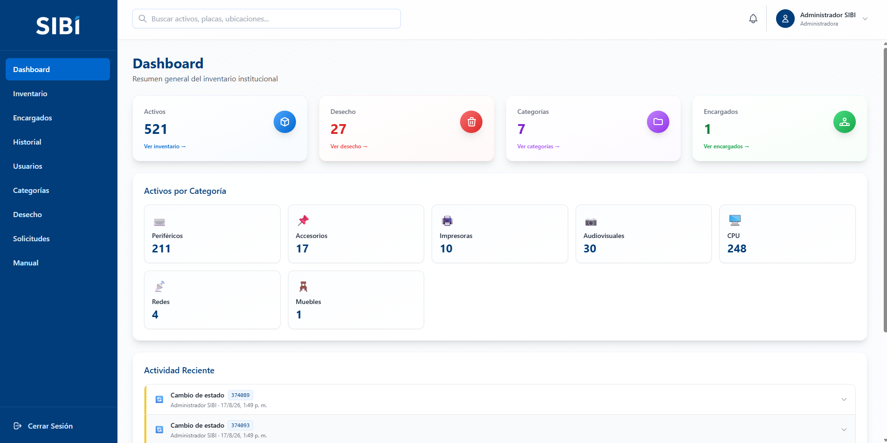
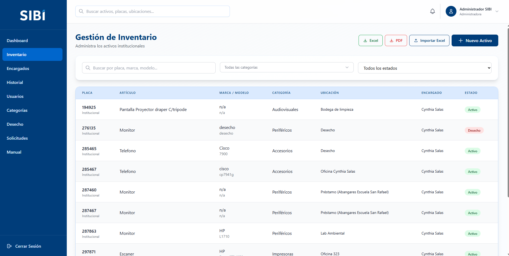
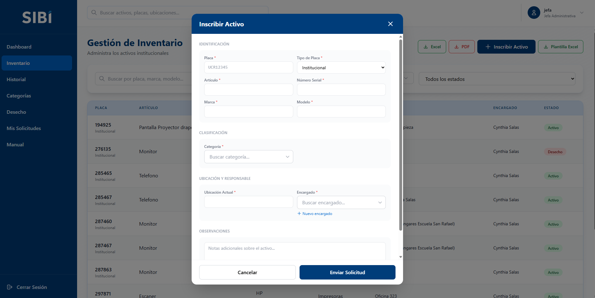
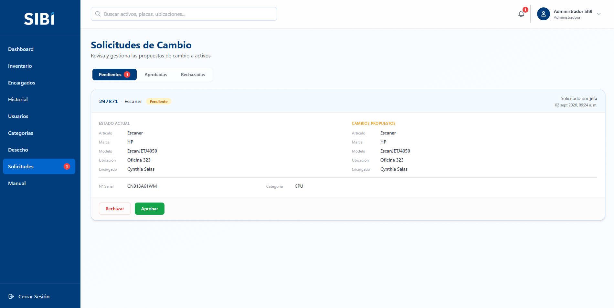
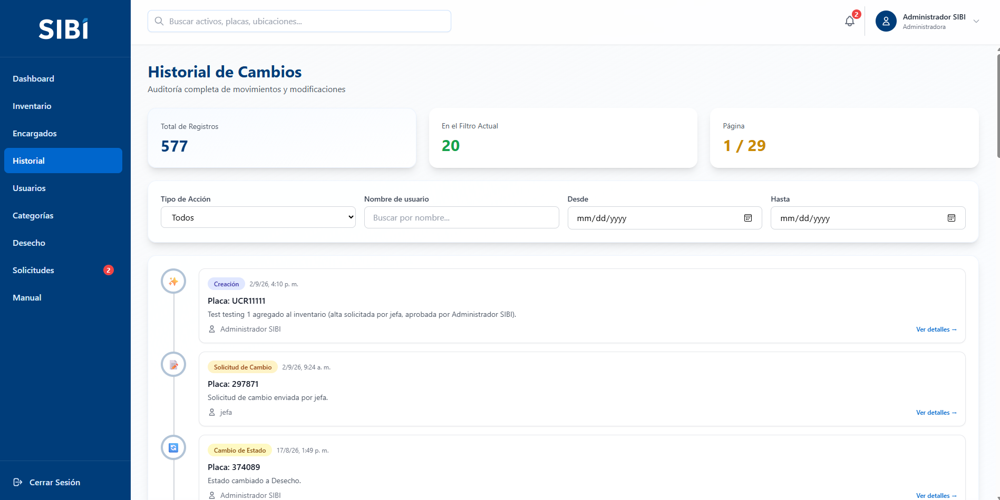
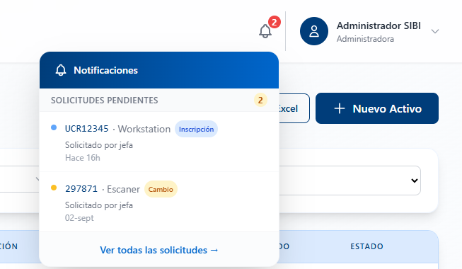
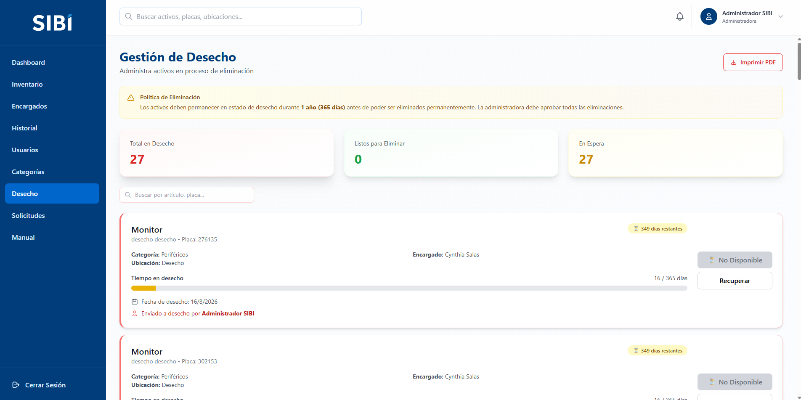

# SIBI — Sistema de Inventario de Bienes Institucionales

Sistema de inventario para la **Escuela de Ingeniería Civil, Universidad de Costa Rica**. Controla el ciclo de vida completo de los activos institucionales: alta, ubicación, encargado, categoría, cambios de estado y baja por desecho, con un flujo de aprobación entre quien solicita y quien administra.

## Capturas

<table>
<tr>
<td width="50%">
<br>
<sub><b>Inicio de sesión</b> — correo institucional, validación de contraseña temporal y bloqueo tras intentos fallidos</sub>
</td>
<td width="50%">
<br>
<sub><b>Panel principal</b> — indicadores del inventario por categoría y estado</sub>
</td>
</tr>
<tr>
<td width="50%">
<br>
<sub><b>Inventario</b> — búsqueda, filtros por categoría/estado/tipo de placa y orden configurable</sub>
</td>
<td width="50%">
<br>
<sub><b>Inscripción de un activo</b> — alta uno a uno, con categoría o encargado nuevos a proponer</sub>
</td>
</tr>
<tr>
<td width="50%">
<br>
<sub><b>Solicitudes</b> — cola de inscripciones y cambios pendientes de aprobar, corregir o rechazar</sub>
</td>
<td width="50%">
<br>
<sub><b>Historial</b> — trazabilidad de cada movimiento sobre un activo</sub>
</td>
</tr>
<tr>
<td width="50%">
<br>
<sub><b>Notificaciones</b> — avisos en tiempo real de nuevas solicitudes (SignalR)</sub>
</td>
<td width="50%">
<br>
<sub><b>Desecho</b> — activos dados de baja, con conteo del período antes de la eliminación definitiva</sub>
</td>
</tr>
</table>

Más capturas por rol en [`manuales-usuario/img/`](manuales-usuario/img/) y en los manuales de usuario.

## Roles

| Rol | Puede |
|---|---|
| **Administradora** | Todo lo de GTI, más gestión de usuarios, categorías y aprobación de eliminaciones definitivas |
| **GTI** | Gestionar inventario, encargados, aprobar/rechazar/corregir solicitudes |
| **Jefa Administrativa** | Inscribir activos y proponer cambios, para que Administradora o GTI los aprueben |
| **Invitado** | Consulta de solo lectura del inventario |

## Stack

- **Backend**: .NET 10 / ASP.NET Core Web API, EF Core, JWT, SignalR
- **Frontend**: Vue 3, Pinia, Vue Router, Tailwind CSS
- **Base de datos**: SQL Server 2022
- **Infraestructura**: Docker Compose (3 contenedores) detrás de un reverse proxy Apache

## Puesta en marcha (Docker)

```bash
cp .env.example .env
# completar MSSQL_SA_PASSWORD y JWT_KEY en .env
docker compose up -d --build
```

El frontend queda publicado en el puerto configurado en `docker-compose.yml` (`frontend.ports`); backend y base de datos solo son alcanzables entre contenedores.

## Documentación

- [`MANUAL_TECNICO.md`](MANUAL_TECNICO.md) — arquitectura, despliegue, base de datos y decisiones de diseño
- [`manuales-usuario/`](manuales-usuario/) — un manual por rol (Administradora, GTI, Jefa Administrativa, Invitado), también en PDF en [`manuales-usuario/pdf/`](manuales-usuario/pdf/)
