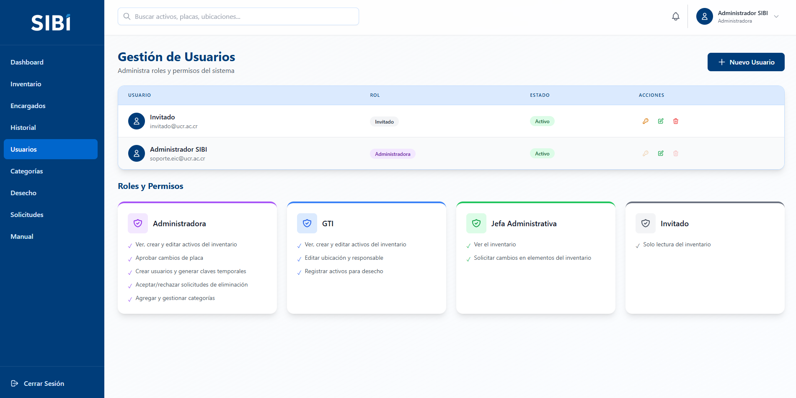
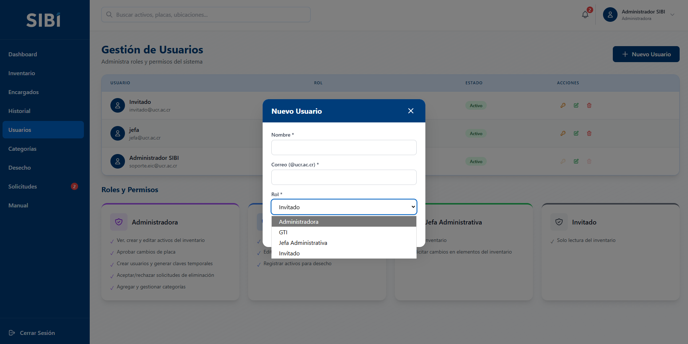
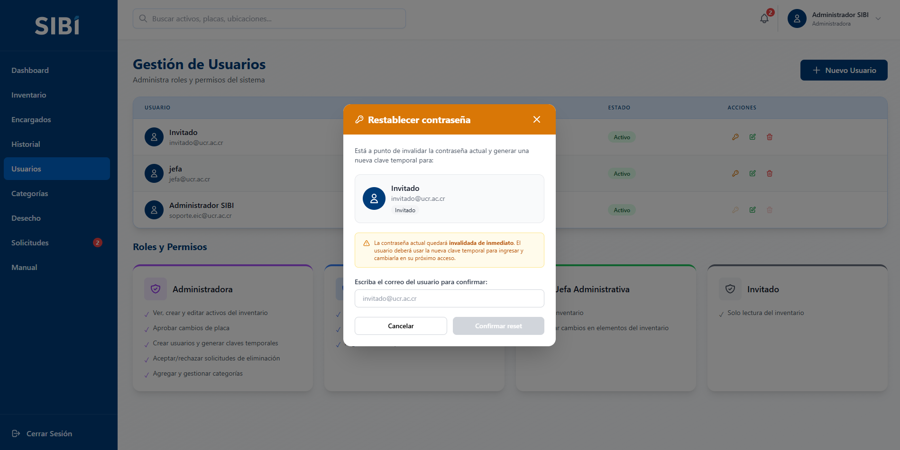
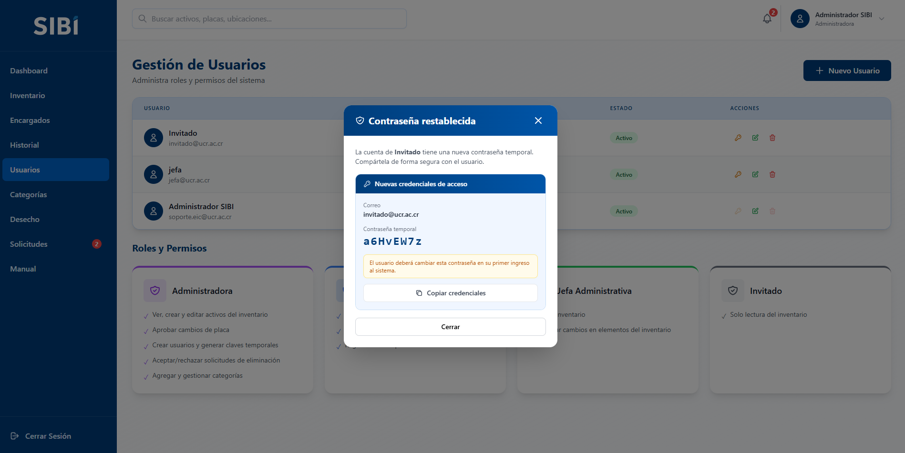
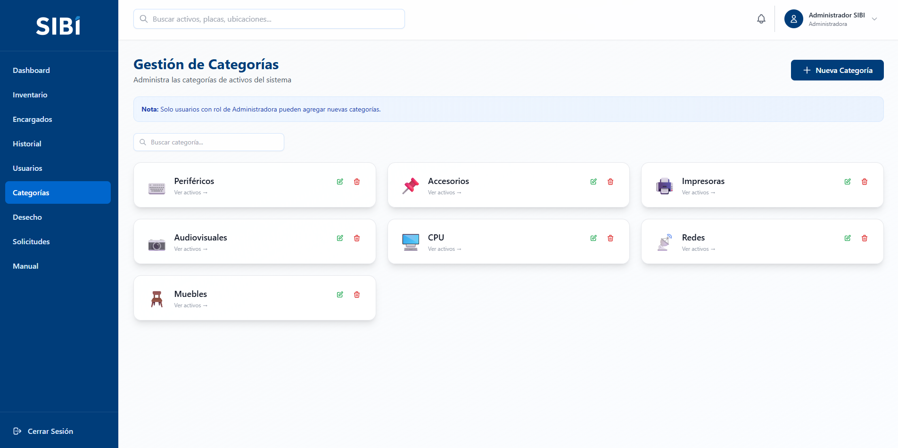
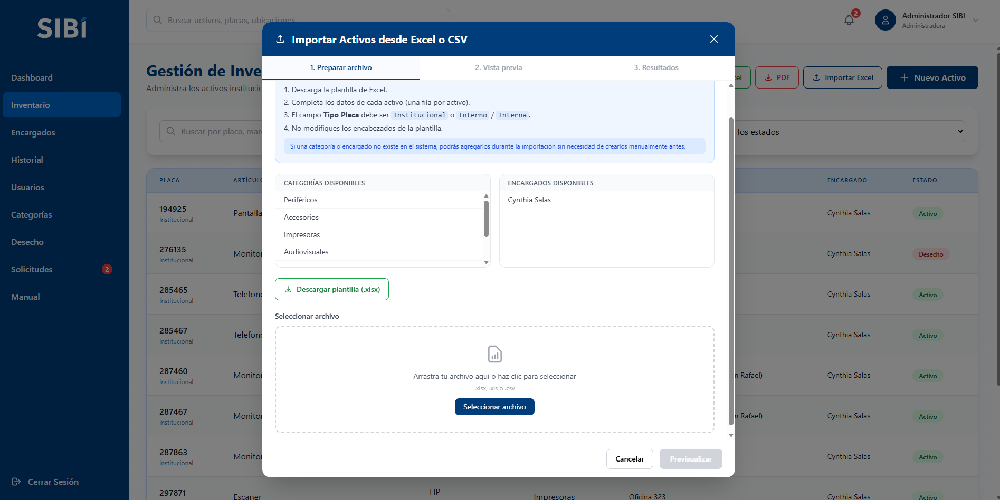
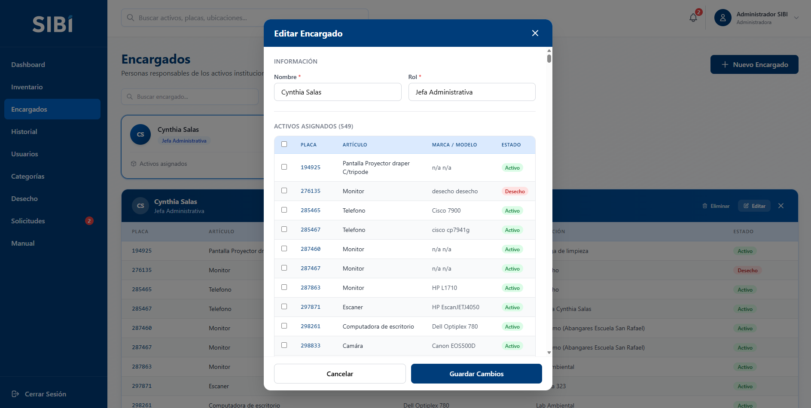

# Manual de Usuario — Rol Administradora

**Sistema SIBI — Inventario de Bienes Institucionales, EIC-UCR**

Este manual es para personas con rol **Administradora**: el nivel de acceso más alto del sistema. Si tu cuenta tiene este rol, tienes control total sobre activos, usuarios, categorías, encargados y las decisiones finales de aprobación/rechazo.

---

## Resumen rápido: qué puedes y qué no puedes hacer

| Acción | ¿Puedes hacerlo? |
|---|:---:|
| Ver Dashboard, inventario, categorías, Desecho | ✅ |
| Ver vista rápida y página de detalle completo de un activo | ✅ |
| Ver historial / auditoría | ✅ |
| Crear un activo individual | ✅ |
| Importar activos en bloque (Excel/CSV) | ✅ |
| Exportar el inventario (Excel/PDF) | ✅ |
| Editar un activo directamente | ✅ |
| Cambiar la placa de un activo | ✅ |
| Enviar un activo a Desecho (directo, un clic) | ✅ |
| Eliminar un activo recién creado (&lt;10 min) | ✅ |
| Crear una solicitud de cambio o de inscripción | ❌ (no las necesitas, creas/editas directo) |
| Aprobar o rechazar solicitudes de cambio | ✅ |
| Aprobar, corregir o rechazar solicitudes de inscripción de activos | ✅ |
| Recuperar un activo desde Desecho | ✅ |
| Aprobar la eliminación definitiva de un activo (Desecho ≥365 días) | ✅ |
| Crear, editar o eliminar categorías | ✅ |
| Crear o editar encargados | ✅ |
| Eliminar o reasignar encargados en bloque | ✅ |
| Crear, editar o eliminar usuarios del sistema | ✅ |
| Desbloquear/restablecer la contraseña de otra cuenta | ✅ (excepto tu propia cuenta y `soporte.eic@ucr.ac.cr`) |
| Cambiar tu propia contraseña (voluntario, con la actual) | ✅ |

---

## 1. ¿Qué puedes hacer con este rol?

La Administradora es la única que puede:

- Gestionar **usuarios del sistema** (crear cuentas, bloquear/desbloquear, restablecer contraseñas, eliminar).
- Gestionar **categorías** de activos (crear, editar, eliminar).
- **Eliminar definitivamente** un activo que lleva un año o más en estado Desecho.
- **Aprobar o rechazar** una solicitud de desecho de un activo.
- **Aprobar o rechazar** las solicitudes de cambio pendientes.
- **Aprobar, corregir o rechazar** las solicitudes de inscripción de activos nuevos que envía la Jefa Administrativa.
- **Eliminar encargados** del sistema.

Además de todo lo anterior, también puedes: ver el dashboard, consultar y buscar el inventario completo, ver el detalle de cualquier activo, ver el historial/auditoría completo, crear y editar activos directamente, importar activos masivamente (Excel o CSV), exportar el inventario a Excel/PDF, gestionar encargados (crear/editar/reasignar) y cambiar la placa de un activo.

En resumen: eres el rol que **no depende de nadie más** para tomar decisiones dentro del sistema, y eres tú quien resuelve las solicitudes y bloqueos de las demás personas usuarias.

---

## 2. Iniciar sesión y primer acceso


*Pantalla de inicio de sesión.*

1. Entra a la URL del sistema y escribe tu correo institucional (`@ucr.ac.cr`) y tu contraseña. El sistema valida que el correo termine en `@ucr.ac.cr` antes de intentar el login.
2. Si tu cuenta es nueva o alguien te restableció la contraseña, el sistema te dará una **contraseña temporal**. Al iniciar sesión con ella, el sistema te obligará automáticamente a cambiarla (pantalla "Cambiar Contraseña") antes de dejarte usar cualquier otra pantalla — ahí solo debes escribir y confirmar la nueva contraseña, no te pide la temporal de nuevo. (Si estas utilizando la cuenta ***soporte.eic@ucr.ac.cr** esta tiene contraseña fija ````Bien.EIC2026*````)
3. La nueva contraseña debe cumplir 4 requisitos, que la pantalla te va marcando en verde a medida que los cumples: **mínimo 6 caracteres, una mayúscula, una minúscula y un número**.
4. Si escribes tu contraseña incorrectamente, la pantalla de login te muestra "Credenciales incorrectas" con un contador ("Intento X de 3") y dos botones: **Cambiar cuenta** (borra también el correo) o **Volver a intentar** (mantiene el correo, solo borra la contraseña). Al tercer intento fallido tu cuenta queda bloqueada y el botón para reintentar se deshabilita.

   
   *Mensaje tras un intento fallido, con el contador "Intento 1 de 3" y los botones "Cambiar cuenta" / "Volver a intentar".*
5. Si esto te pasa a ti (tu propia cuenta queda bloqueada), necesitas que **otra cuenta con este mismo nivel de acceso** te desbloquee desde la sección de Usuarios (ver punto 4). Por eso es buena práctica que exista más de una cuenta con acceso total activa al mismo tiempo.
6. Si olvidaste tu contraseña, el enlace "¿Olvidaste tu contraseña?" en el login **no es un formulario de recuperación automática**: te lleva a una pantalla informativa que solo indica escribir a **soporte.eic@ucr.ac.cr** o contactar a un administrador. No hay envío automático de correo con clave nueva — la recuperación es siempre manual, por lo que si eres la única Administradora activa y pierdes el acceso, necesitas intervención directa del equipo técnico sobre la base de datos.
7. **Cambio de contraseña voluntario**: en cualquier momento, sin estar bloqueada ni con contraseña temporal, puedes abrir el menú de tu perfil (esquina superior derecha) y elegir "Cambiar contraseña". A diferencia del cambio forzado del primer ingreso, aquí el sistema **sí te pide la contraseña actual**, además de la nueva y su confirmación.

---

## 3. Dashboard

Al iniciar sesión llegas al Dashboard, con tarjetas resumen: total de activos, activos en desecho, cantidad de categorías y encargados. Cada tarjeta es un atajo: haz clic para ir directo a esa sección (por ejemplo, la tarjeta "Desecho" te lleva al listado de activos pendientes de decisión).


*Dashboard: menú lateral completo (Usuarios, Solicitudes, etc.) y tarjetas de resumen con "Activos por Categoría".*

---

## 4. Gestión de usuarios del sistema

Esta pantalla (menú "Usuarios", visible solo para tu rol) tiene una tabla con cada cuenta (nombre, correo, rol, estado Activo/Inactivo, y una etiqueta "Bloqueado" si acumula 3 intentos fallidos) y, debajo, tarjetas descriptivas de qué puede hacer cada rol. Acciones disponibles:


*Gestión de Usuarios: tabla de cuentas con acciones (llave, lápiz, basura) y tarjetas "Roles y Permisos".*

- **Crear un usuario nuevo** (botón "Nuevo Usuario"): indicas nombre, correo (debe terminar en `@ucr.ac.cr`, si no el sistema lo rechaza) y el rol (Administradora, GTI, Jefa Administrativa o Invitado). Al guardar, el sistema muestra en pantalla el correo y una **contraseña temporal de 8 caracteres**, con un botón "Copiar credenciales" y la advertencia de que, una vez cierres ese recuadro, **la contraseña no vuelve a mostrarse** — el sistema te pide confirmar explícitamente ("¿Ya guardó las credenciales?") antes de dejarte cerrarlo. Debes comunicarla a la persona por un canal seguro (Teams, en persona, etc.); no se envía por correo automáticamente.

  
  *"Nuevo Usuario": nombre, correo `@ucr.ac.cr` y rol (Administradora, GTI, Jefa Administrativa o Invitado).*

- **Desbloquear una cuenta** (ícono de candado, visible solo si la cuenta tiene 3+ intentos fallidos): genera una contraseña temporal nueva y resetea el contador de intentos fallidos. Muestra el mismo tipo de recuadro de credenciales de un solo vistazo. **Excepción**: sobre la cuenta de soporte (`soporte.eic@ucr.ac.cr`) el botón puede aparecer, pero al usarlo el sistema lo rechaza con el mensaje *"La contraseña de la cuenta principal no puede modificarse desde la aplicación."* — ver la advertencia más abajo.
- **Restablecer la contraseña de otra persona** (ícono de llave): abre un flujo de dos pasos por seguridad. Primero debes **escribir el correo exacto de esa persona** para confirmar (el botón de confirmar solo se activa si coincide letra por letra); el sistema te advierte que la contraseña actual queda invalidada de inmediato. Al confirmar, se genera la nueva temporal. No puedes usar esta opción sobre tu propia cuenta ni sobre la cuenta de soporte (`soporte.eic@ucr.ac.cr`) — ambos íconos aparecen deshabilitados para esos casos.

  
  *Paso 1 del restablecimiento: hay que escribir el correo exacto de la persona para habilitar "Confirmar reset".*

  
  *Paso 2: la nueva contraseña temporal se muestra una sola vez, con botón "Copiar credenciales".*
- **Editar** (ícono de lápiz): nombre, rol o estado (Activo/Inactivo) de una cuenta. Si una cuenta pasa a estado **Inactivo** el sistema no permite que esa cuenta logre iniciar sesión en el sistema, aunque la contraseña ingresada sea la correcta, solo pasando la cuenta a estado **Activo** la cuenta vuelve a estar disponible para ingresar al sistema.
- **Eliminar** (ícono de basura): no puedes eliminar tu propia cuenta ni la cuenta de soporte — ambos íconos aparecen deshabilitados para esos casos.

**Protecciones especiales sobre `soporte.eic@ucr.ac.cr`**: no se le puede cambiar el rol (el selector de rol aparece bloqueado en su formulario de edición), no se le puede desactivar (el campo "Estado" ni siquiera aparece al editarla) y no se puede eliminar. Es la cuenta de resguardo para que el sistema nunca se quede sin una Administradora funcional. Tiene una **contraseña fija** (`Bien.EIC2026*`) que **no puede cambiarse desde ninguna pantalla de la aplicación**: ni con "¿Olvidaste tu contraseña?", ni con el cambio de contraseña voluntario desde esa misma cuenta, ni con "Desbloquear" o "Restablecer" desde otra cuenta Administradora — todas esas vías la rechazan explícitamente. Solo se puede modificar directamente en la base de datos.

⚠️ **Importante**: como ninguna de las vías de desbloqueo funciona sobre `soporte.eic@ucr.ac.cr`, si esa cuenta acumula 3 intentos fallidos de inicio de sesión (por ejemplo, si alguien escribe mal la contraseña fija varias veces) **queda bloqueada sin ninguna forma de desbloquearla desde la aplicación**, ni siquiera por otra Administradora. En ese caso se necesita intervención directa del equipo técnico sobre la base de datos (resetear `IntentosFallidos` a 0). Ten especial cuidado al escribir su contraseña.

**Recomendación de buenas prácticas**: no dejes solo un usuario con acceso total activo en el sistema. Si esa única cuenta se bloquea o pierde acceso, nadie podrá desbloquearla desde dentro del sistema y se necesitará intervención directa en la base de datos.

---

## 5. Gestión de categorías

Las categorías (por ejemplo: "Computadoras", "Mobiliario", "Equipo de laboratorio") clasifican los activos y también dan forma a las estadísticas del Dashboard. En "Categorías" ves una cuadrícula de tarjetas; al hacer clic sobre cualquiera (sin necesidad de editar) se despliega un panel con los activos de esa categoría, con su propio buscador interno.


*Gestión de Categorías: botón "Nueva Categoría" e íconos de editar/eliminar en cada tarjeta (visibles solo para Administradora).*

Solo tú puedes:

- Crear una categoría nueva (botón "Nueva Categoría"): nombre y un ícono — eliges un emoji de una paleta agrupada por temas, o escribes uno personalizado en el campo "Otro emoji".
- Editar el nombre o ícono de una categoría existente (ícono de lápiz sobre la tarjeta).
- Eliminar una categoría (ícono de basura) — **solo si no tiene activos asociados**. Si intentas borrar una con activos, el sistema te lo va a impedir; primero hay que reclasificar esos activos a otra categoría.

---

## 6. Inventario: crear, editar, importar, exportar y cambiar placa

Tienes acceso completo a la pantalla de Inventario, incluyendo los botones "Excel", "PDF", "Importar Excel" y "Nuevo Activo" en la parte superior:


*Inventario: botones "Excel", "PDF", "Importar Excel" y "Nuevo Activo"; tabla con búsqueda y filtros.*

- **Crear un activo nuevo**: placa, tipo de placa (Institucional o Interno), marca, modelo, número de serie, artículo, categoría, ubicación y encargado responsable. Puedes crear una categoría o un encargado nuevo desde el mismo formulario si no existe todavía.
- **Editar un activo**: puedes cambiar cualquier campo, incluyendo su estado (Activo / Mantenimiento / Desecho) y reasignar ubicación/encargado. Si cambias estado a Desecho, el sistema registra automáticamente la fecha; si lo devuelves a Activo, esa fecha se limpia. También tienes, en la vista rápida de un activo, un botón directo de un clic **"Enviar a Desecho"** (con confirmación) que hace lo mismo sin necesidad de abrir el formulario completo de edición.
- **Cambiar la placa** de un activo (por ejemplo, si se identificó un error de captura o se reetiquetó físicamente el bien). El sistema conserva todo el historial y las solicitudes asociadas al pasar a la nueva placa.
- **Importar activos masivamente**: descarga la plantilla, complétala sin modificar los encabezados (acepta `.xlsx`, `.xls` o `.csv`), y súbela. El sistema valida fila por fila y te muestra cuáles se importaron con éxito y cuáles fallaron (con el motivo exacto: categoría no encontrada, encargado ambiguo, placa duplicada, etc.).
- **Exportar el inventario** a Excel o PDF con los botones correspondientes, respetando los filtros de búsqueda/categoría/estado que tengas activos en ese momento.
- **Deshacer una creación reciente**: si acabas de crear un activo (o alguien más lo hizo) y notas un error grave, puedes eliminarlo directamente **solo dentro de los primeros 10 minutos** desde su creación (verás un contador regresivo en el botón "Eliminar"). Pasado ese tiempo, ya no se puede borrar así — hay que editarlo o, si corresponde, pasarlo por el flujo de Desecho.

---

## 7. Paso a paso: cómo ingresar activos (uno por uno o en bloque)

### 7.1 Ingresar un activo individual

1. Ve a "Inventario" y haz clic en **"Nuevo Activo"** (arriba a la derecha).
2. Completa el formulario, dividido en cuatro bloques:
   - **Identificación**: Placa* (máx. 8 caracteres), Tipo de Placa* (Institucional o Interno), Artículo* (máx. 20), N° Serial* (máx. 30), Marca* (máx. 30), Modelo* (máx. 20).
   - **Clasificación**: Categoría* — búscala en el selector; si no existe, haz clic en "Nueva categoría" (justo debajo del selector) para crearla sin salir del formulario, indicando nombre e ícono.
   - **Ubicación y Responsable**: Ubicación Actual* (texto libre, máx. 30) y Encargado* — búscalo en el selector, o crea uno nuevo con "Nuevo encargado" (nombre y cargo/rol) sin salir del formulario.
   - **Observaciones** (opcional, hasta 200 caracteres).
3. Haz clic en **"Confirmar y Crear"**: se abre una pantalla de revisión con todos los datos agrupados. Si algo está mal, usa el botón "Editar" para volver al formulario; si todo está correcto, haz clic en **"Confirmar y Crear"** de nuevo para guardarlo definitivamente.
4. El activo queda creado con estado "Activo" y aparece de inmediato en el inventario. Si detectas un error justo después (por ejemplo, la placa mal escrita), puedes eliminarlo con el botón "Eliminar" en su vista rápida — solo funciona **dentro de los primeros 10 minutos** desde la creación (verás la cuenta regresiva en el propio botón).

### 7.2 Ingresar activos en bloque (Excel o CSV)

Este es un asistente de 3 o 4 pasos (el paso de "Entidades" solo aparece si hace falta resolver algo):


*Paso 1 del asistente: listas de categorías/encargados existentes, botón "Descargar plantilla (.xlsx)" y zona de carga del archivo.*

1. En "Inventario", haz clic en **"Importar Excel"**. En el **paso 1 ("Preparar archivo")** verás la lista de categorías y encargados que ya existen en el sistema (útil para escribir los nombres exactos en tu archivo) y el botón **"Descargar plantilla (.xlsx)"**. Complétala con una fila por activo, **sin modificar los encabezados**, respetando el orden de columnas: `Placa, Tipo Placa, Artículo, Marca, Modelo, N° Serial, Categoría, Ubicación Actual, Encargado, Observaciones`. El campo Tipo Placa debe ser `Institucional` o `Interno`/`Interna`. Luego arrastra el archivo a la zona de carga o haz clic para seleccionarlo (acepta `.xlsx`, `.xls` o `.csv`).
2. Haz clic en **"Previsualizar"** para pasar al **paso 2 ("Vista previa")**: una tabla te muestra cada fila con sus datos y, si hay un problema, el motivo en rojo. Las categorías o encargados que el sistema no reconoce se marcan con una etiqueta amarilla "Nuevo", y los nombres de encargado que coinciden con más de una persona registrada se marcan "Duplicado". Si hay errores de datos (campos vacíos, etc.), corrige el archivo original y vuelve a subirlo desde el paso 1.
3. Si todas las filas son válidas y no hay entidades nuevas ni ambiguas, el botón dice directamente **"Importar N activos"** — haz clic y listo. Si el sistema detectó categorías/encargados nuevos o nombres duplicados, en cambio verás **"Siguiente →"**, que te lleva al **paso 3 ("Entidades")**, donde:
   - Apruebas o descartas cada categoría/encargado nuevo (checkbox), indicando ícono para categorías y cargo/rol para encargados.
   - Para nombres parecidos a uno ya existente, eliges si es "la misma" (usar la existente) o si en realidad es una nueva.
   - Para nombres duplicados dentro del propio archivo (la misma categoría o persona escrita de formas distintas), eliges cuál nombre usar para todas esas filas.
   - Para encargados con nombre ambiguo en el sistema (varias personas con el mismo nombre), eliges cuál de ellas es la correcta para esas filas.
4. Haz clic en **"Confirmar e importar"**: llegas al **paso 4 ("Resultados")**, con el conteo de activos creados, placas que ya existían (omitidas) y filas con error (con el detalle de cada una). Los activos creados ya están disponibles en el inventario al cerrar el asistente.

---

## 8. Desecho: aprobar o rechazar bajas definitivas

Esta pantalla es visible para cualquier rol (incluye un botón "Imprimir PDF" para exportar el reporte), pero **las acciones son exclusivas de tu rol**. Un activo llega a Desecho de dos formas: directamente (alguien con permiso de edición lo marca así) o por una solicitud de desecho aprobada. En ambos casos, si hay información disponible, verás quién lo envió o solicitó y quién lo aprobó, en una nota "Responsable del desecho" sobre cada tarjeta. Cada tarjeta muestra una barra de progreso de días transcurridos sobre 365.


*Gestión de Desecho: cada tarjeta con su barra de progreso hacia 365 días y los botones "Recuperar" y "Aprobar Eliminación" ("No Disponible" hasta cumplir el plazo).*

Tú decides:

- **Recuperar** (botón): el activo vuelve a estado Activo, como si nunca se hubiera propuesto desechar.
- **Aprobar Eliminación** (botón, solo habilitado cuando el activo lleva 365 días o más en Desecho): abre una confirmación con los datos del activo, y luego una **segunda confirmación** más severa (con una pequeña animación de advertencia) antes de ejecutar el borrado. Esta acción es irreversible: borra el activo y todo lo asociado a esa placa (historial, solicitudes de cambio) de forma permanente. Úsala con mucho cuidado — no hay manera de deshacerla desde el sistema.

Este período de espera de un año es una salvaguarda intencional del sistema para evitar bajas apresuradas.

---

## 9. Solicitudes: aprobar, corregir o rechazar

La Jefa Administrativa no edita ni da de alta activos directamente: lo hace mediante solicitudes que tú (o GTI) resuelven. En el menú **"Solicitudes"** hay un selector arriba para alternar entre **"Inscripción de activos"** (altas de activos nuevos) y **"Cambios a activos"** (modificaciones a activos existentes), cada uno con su propio contador; debajo, las pestañas Pendiente / Aprobada / Rechazada.

### 9.1 Solicitudes de cambio

1. Cada tarjeta muestra un comparativo de los valores actuales del activo contra los propuestos. Las solicitudes específicamente para enviar un activo a Desecho se muestran distintas (borde y etiqueta roja "Desecho"), con una tarjeta simplificada.

   
   *Solicitud de cambio pendiente: comparación "Estado actual" vs. "Cambios propuestos" y los botones "Aprobar" / "Rechazar". (Captura previa a la incorporación del selector "Inscripción de activos / Cambios a activos".)*
2. **Aprobar**: aplica automáticamente todos los cambios propuestos al activo real (incluyendo, si corresponde, un cambio de ubicación/encargado, o el paso a Desecho con su fecha) y queda registrado en el historial.
3. **Rechazar**: puedes agregar un comentario explicando por qué. El activo no cambia.

### 9.2 Solicitudes de inscripción de activos

1. En el selector **"Inscripción de activos"** ves cada alta propuesta con todos sus datos y una etiqueta "Inscripción". Haz clic en **"Revisar"** para abrirla.

   
   *"Revisar Inscripción de Activo": el selector de origen arriba, y el formulario con "Guardar cambios", "Rechazar" y "Aprobar y registrar".*
2. Se abre un formulario con **todos los campos editables**:
   - **Guardar cambios**: corrige cualquier dato propuesto sin aprobar todavía.
   - **Rechazar**: no se crea ningún activo; el motivo que dejes lo verá la Jefa en "Mis Solicitudes".
   - **Aprobar y registrar**: crea el activo en el inventario de forma oficial (estado "Activo"), con los datos ya corregidos si editaste algo. Queda en el historial como una creación.
3. **La inscripción puede proponer una categoría o un encargado nuevos** (la Jefa lo hace desde el mismo formulario de inscribir). Cuando es así, un banner ámbar lo indica y el campo trae un toggle **"Existente / Nueva (a crear)"**: puedes ajustar la propuesta (nombre, icono, rol) o cambiarla por una entrada existente. Al **aprobar**, el sistema crea primero esa categoría/encargado —o reutiliza la fila si el nombre ya coincide— y luego el activo. Al **rechazar**, no se crea nada.
4. Al aprobar, el sistema revalida que la placa no haya sido ocupada mientras la solicitud estaba pendiente; si ya existe un activo con esa placa, habrá que ajustar la solicitud o rechazarla.

Recibirás una notificación en tiempo real (ícono de campana) cada vez que llegue una solicitud nueva de cualquiera de los dos tipos; el contador junto al ítem "Solicitudes" suma las pendientes de cambio **y** de inscripción.


*Panel de la campana: cada solicitud pendiente lleva su etiqueta "Inscripción" o "Cambio"; "Ver todas las solicitudes →" abre la bandeja completa.*

---

## 10. Encargados

Los encargados son las personas responsables de cada bien (no necesariamente tienen cuenta en el sistema). En la pantalla "Encargados" ves tarjetas con sus iniciales, rol y cantidad de activos asignados; al hacer clic despliegas un panel con el detalle de esos activos. Puedes:

- Crear (botón "Nuevo Encargado") y editar (dentro del panel expandido) nombre y rol.
- Ver el listado de encargados con la cantidad de activos que tiene asignado cada uno.
- **Reasignar en bloque**: dentro del modal "Editar Encargado" hay una tabla con los activos de ese encargado y una casilla de selección en cada fila (o "seleccionar todos"). Al marcar uno o varios, aparece una barra con un selector "Reasignar a..." y un botón "Aplicar" para moverlos de una vez a otro encargado.
- **Eliminar** un encargado (botón visible solo en el panel expandido) — solo si no tiene activos asignados actualmente. Si tiene, primero debes reasignarlos.


*"Editar Encargado": nombre y rol arriba, y la lista de "Activos asignados" con casillas para la reasignación en bloque.*

---

## 11. Historial / auditoría

En "Historial" puedes consultar **todos** los movimientos registrados en el sistema, presentados como línea de tiempo. Filtros disponibles: **Tipo de Acción** (Creación, Cambio de Ubicación, Cambio de Encargado, Cambio de Estado, Cambio de Placa, Aprobación, Eliminación, Rechazo, Solicitud de Cambio, Solicitud Aprobada, Solicitud Rechazada), **nombre de usuario**, y rango de fechas (**Desde/Hasta**). Al hacer clic en cualquier registro se abre un modal con el detalle del activo relacionado y un enlace para ir a su ficha completa. Es tu herramienta principal para auditar qué pasó con un bien y quién hizo cada cambio.


*Historial: contadores arriba, filtros (tipo de acción, usuario, fechas) y la línea de tiempo. Una inscripción aprobada figura como "Creación" con la nota "alta solicitada por …, aprobada por …".*

---

## 12. Limitaciones a tener en cuenta

- No puedes eliminar tu propia cuenta de usuario, ni restablecer tu propia contraseña desde la sección de Usuarios (por seguridad).
- No puedes modificar el rol de la cuenta institucional `soporte.eic@ucr.ac.cr`, ni eliminarla, ni desactivarla — está protegida para que el sistema nunca se quede sin una cuenta administradora funcional.
- La eliminación definitiva de un activo en Desecho requiere sí o sí que hayan pasado 365 días desde que se marcó como Desecho; el sistema no permite saltarse este plazo aunque seas Administradora.
- Las acciones de eliminación definitiva (activo, encargado con activos, categoría con activos) son irreversibles o están bloqueadas por el sistema hasta que se resuelvan sus dependencias — revisa bien antes de confirmar.
- El envío de contraseñas temporales por correo **no está activo todavía**; debes comunicarlas tú mismo/a por un medio seguro a la persona usuaria, y anotarlas antes de cerrar el recuadro de credenciales, porque no vuelven a mostrarse.

---

## 13. Preguntas frecuentes y errores comunes

**"No puedo eliminar un activo aunque lleva meses en Desecho."**
El sistema exige **365 días exactos** desde la `Fecha de Desecho`, no "meses" aproximados. El botón "Aprobar Eliminación" permanece deshabilitado ("No Disponible") hasta que se cumpla el plazo completo; la tarjeta del activo te muestra cuántos días le faltan.

**"El sistema no me deja eliminar una categoría."**
Mensaje: *"No se puede eliminar una categoría con activos asociados."* Primero tienes que reclasificar (editar) todos los activos de esa categoría hacia otra, y solo entonces podrás eliminarla.

**"No puedo eliminar un encargado."**
Mensaje: *"No se puede eliminar un encargado que tiene activos asignados."* Usa la reasignación en bloque (dentro de "Editar Encargado") para mover todos sus activos a otro encargado antes de eliminarlo.

**"Cerré el recuadro de la contraseña temporal sin copiarla."**
No hay forma de volver a verla: el sistema solo la muestra una vez y por eso pide confirmar "¿Ya guardó las credenciales?" antes de cerrar. Si ya se cerró, tu única opción es generar una nueva (botón de desbloquear o de restablecer contraseña sobre esa cuenta), lo que invalida la anterior.

**"No puedo restablecer mi propia contraseña ni la de la cuenta de soporte."**
Para tu propia cuenta es una restricción de seguridad intencional: pide a otra cuenta con tu mismo nivel de acceso que te la restablezca, o usa el enlace de recuperación del login (que remite a contactar soporte técnico). La cuenta `soporte.eic@ucr.ac.cr` es distinta: tiene una **contraseña fija que no se puede modificar desde ninguna parte de la aplicación** (ni recuperación, ni cambio voluntario, ni desbloqueo, ni restablecimiento por otra Administradora) — solo se cambia directamente en la base de datos. Si esa cuenta se bloquea, no hay forma de desbloquearla desde el sistema.

**"Quiero crear un usuario pero el sistema lo rechaza."**
Mensaje típico: *"Solo se permiten correos con dominio @ucr.ac.cr"* o *"Ya existe un usuario con ese correo."* Verifica que el correo termine exactamente en `@ucr.ac.cr` y que no exista ya una cuenta con ese correo (aunque esté inactiva).

**"Aprobé una solicitud de cambio pero el resultado no es el que esperaba."**
La solicitud guarda una fotografía de los datos propuestos en el momento en que se creó. Si el activo cambió por otro medio entre que se envió la solicitud y la aprobaste, revisa con cuidado el comparativo antes de aprobar — una vez aprobada, los cambios se aplican tal cual se propusieron originalmente.

**"Al aprobar una solicitud de inscripción me dice que la placa ya existe."**
Entre que la Jefa la envió y tú la aprobaste, alguien registró un activo con esa placa (directamente o aprobando otra inscripción). El sistema no crea el activo duplicado: ajusta la placa en la solicitud (botón "Revisar" → editar → "Guardar cambios") y vuelve a aprobar, o recházala si ya no corresponde.

**"Corregí datos en una solicitud de inscripción, ¿se aprueban con mis correcciones?"**
Sí. "Aprobar y registrar" guarda primero cualquier cambio que hayas hecho en el formulario y luego crea el activo con esos datos ya corregidos.

**"Quiero cambiarle el rol a la cuenta de soporte y no me deja."**
Mensaje: *"El rol de la cuenta de soporte no puede modificarse."* Es intencional: esa cuenta siempre debe quedar como Administradora para que el sistema nunca se quede sin acceso total.

**"Creé una categoría o encargado con un nombre que ya existía."**
El sistema rechaza nombres duplicados de categoría, y duplicados de nombre+rol para encargados, con un mensaje de conflicto. Ajusta el nombre o edita el registro existente en vez de crear uno nuevo.

---

## 14. ¿A quién acudir?

Como Administradora, **tú eres el punto de contacto principal** para las demás personas usuarias del sistema (creación de cuentas, desbloqueos, restablecimiento de contraseñas, dudas sobre categorías o permisos).

Si el problema es **técnico** (el sistema no carga, error del servidor, la base de datos parece inconsistente, necesitas un cambio de configuración o de infraestructura), ese tipo de incidencias debe escalarse al equipo de desarrollo/soporte técnico del sistema, fuera del propio SIBI.
