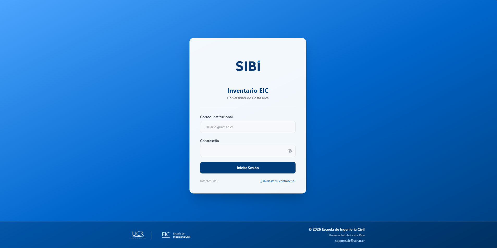
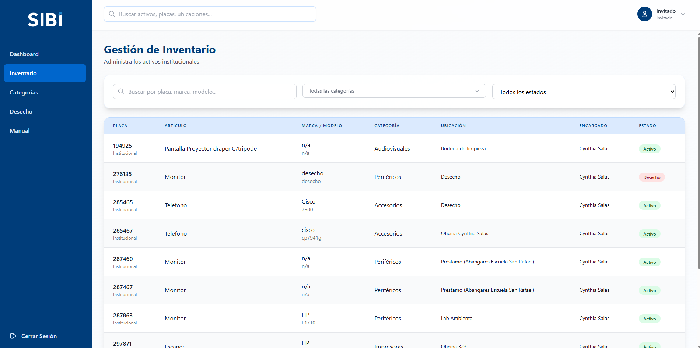
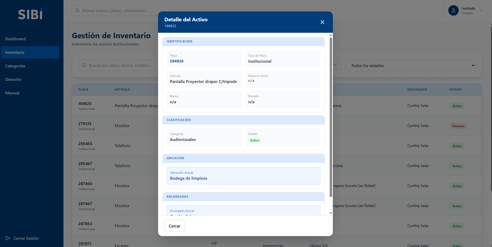
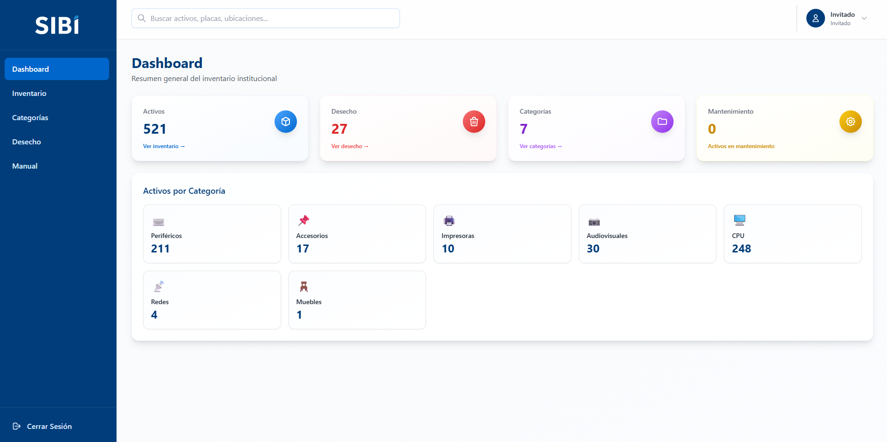

# Manual de Usuario — Rol Invitado

**Sistema SIBI — Inventario de Bienes Institucionales, EIC-UCR**

Este manual es para personas con rol **Invitado**: el nivel de acceso más básico del sistema, pensado para consulta general del inventario, sin posibilidad de modificar nada ni ver información sensible de auditoría.

---

## Resumen rápido: qué puedes y qué no puedes hacer

| Acción | ¿Puedes hacerlo? |
|---|:---:|
| Ver el Dashboard | ✅ |
| Ver y buscar/filtrar el inventario | ✅ |
| Ver la vista rápida de un activo | ✅ |
| Ver la página de detalle completo de un activo | ❌ |
| Ver historial / auditoría | ❌ |
| Crear, editar, importar o exportar activos | ❌ |
| Ver la lista de Desecho | ✅ (solo lectura) |
| Actuar sobre Desecho (recuperar / aprobar eliminación) | ❌ |
| Ver categorías y los activos de cada una | ✅ |
| Crear, editar o eliminar categorías | ❌ |
| Ver o gestionar Encargados | ❌ |
| Ver o crear Solicitudes de cambio | ❌ |
| Acceso a la sección de Usuarios del sistema | ❌ |
| Cambiar tu propia contraseña (voluntario, con la actual) | ✅ |

---

## 1. ¿Qué puedes hacer con este rol?

- Iniciar sesión con tu cuenta institucional y cambiar tu propia contraseña cuando quieras.
- Ver el **Dashboard**, con estadísticas generales: total de activos, cantidad en desecho y cantidad de categorías.
- Consultar el **inventario completo**: buscar por texto (placa, marca, modelo, número de serie, artículo), y filtrar por una o varias categorías a la vez, o por estado (Activo / Mantenimiento / Desecho).
- Hacer clic sobre un activo en la tabla de Inventario para abrir una **vista rápida de solo lectura** con sus datos principales (marca, modelo, categoría, ubicación, encargado, estado, observaciones).
- Ver el listado de **categorías** existentes y, al hacer clic sobre una, un panel con los activos que contiene (con su propio buscador).
- Ver el listado de **Desecho**, en modo solo lectura (sin botones para aprobar/rechazar), incluyendo la barra de progreso hacia los 365 días. También puedes exportar esa lista a PDF con el botón "Imprimir PDF".
- Usar el **buscador rápido** en la parte superior del sistema para encontrar un activo por placa, artículo, marca, modelo o encargado.

## 2. Lo que NO puedes hacer

Tu cuenta es de **solo consulta general**. Específicamente no puedes:

- **Abrir la página de detalle completo** de un activo (la que muestra ubicación anterior, encargado anterior y su historial de movimientos) — desde la vista rápida que sí puedes abrir, el botón para ir a esa página de detalle no aparece para tu rol.
- **Ver el historial/auditoría** general del sistema (quién hizo qué cambio y cuándo).
- Crear, editar, importar ni exportar activos.
- Aprobar o rechazar bajas en la sección de Desecho (solo puedes verla, no actuar sobre ella).
- Ver ni gestionar la sección de **Encargados**.
- Ver ni gestionar **Solicitudes de cambio** ni **Mis Solicitudes**.
- Acceder a la sección de **Usuarios** del sistema.
- Crear, editar ni eliminar categorías.

Si intentas entrar directamente a alguna de las secciones restringidas (Encargados, Historial, Usuarios, Solicitudes, el detalle completo de un activo) escribiendo la dirección en el navegador, el sistema te redirigirá automáticamente de vuelta al Dashboard, porque no tienes permiso para verlas.

---

## 3. Iniciar sesión y primer acceso

*Pantalla de inicio de sesión.*

1. Ingresa con tu correo institucional (`@ucr.ac.cr`) y tu contraseña.
2. Si tu cuenta es nueva o alguien te restableció la contraseña, usarás una contraseña temporal que te habrán comunicado directamente (no llega automáticamente por correo). Al ingresar con ella, el sistema te obligará a cambiarla (pantalla "Cambiar Contraseña") antes de dejarte ver cualquier otra pantalla — solo debes escribir y confirmar la nueva.
3. La contraseña nueva debe cumplir 4 requisitos que la pantalla marca en verde a medida que los completas: mínimo 6 caracteres, una mayúscula, una minúscula y un número.
4. Si te equivocas de contraseña, el login muestra "Credenciales incorrectas" con un contador ("Intento X de 3"). Al tercer intento fallido tu cuenta queda bloqueada automáticamente y necesitarás que un administrador del sistema te la desbloquee.
5. El enlace "¿Olvidaste tu contraseña?" **no genera una clave nueva automáticamente**: te lleva a una pantalla informativa que indica escribir a soporte.eic@ucr.ac.cr o contactar a un administrador para que te restablezcan el acceso manualmente.
6. **Cambio de contraseña voluntario**: en cualquier momento (sin estar bloqueado ni con contraseña temporal) puedes abrir el menú de tu perfil, arriba a la derecha, y elegir "Cambiar contraseña". A diferencia del cambio forzado del primer ingreso, aquí el sistema sí te pide la contraseña actual, además de la nueva y su confirmación.

---

## 4. Consultar el inventario

*Inventario para el rol Invitado: tabla, búsqueda y filtros, sin botones de acción.*

1. Ve al menú "Inventario".
2. Usa el campo de búsqueda para escribir una placa, marca, modelo, número de serie o nombre de artículo — la lista se filtra automáticamente.
3. Puedes combinar la búsqueda con filtros por **categoría** (una o varias a la vez, con un selector de casillas) y por **estado** (Activo, Mantenimiento o Desecho).
4. La lista está paginada; usa los controles de página para recorrer todos los resultados.

Al hacer clic sobre cualquier fila de la tabla se abre una ventana con los datos principales de ese activo en modo solo lectura. No verás ahí el botón para ir a la página de detalle ampliado (esa página incluye información adicional como la ubicación/encargado anteriores, reservada para los demás roles).

*Vista rápida de un activo: solo el botón "Cerrar", sin acciones.*

También puedes usar el **buscador rápido** en la parte superior de cualquier pantalla para encontrar un activo específico sin ir primero a la pantalla de Inventario.

---

## 5. Dashboard

Al iniciar sesión llegas al Dashboard con tarjetas resumen: cantidad total de activos, cantidad en desecho, y cantidad de categorías. Puedes hacer clic en ellas para navegar a las secciones que sí tienes permitido ver (Inventario, Desecho y Categorías).

*Dashboard del rol Invitado: menú lateral reducido y tarjetas de resumen.*

---

## 6. Limitaciones a tener en cuenta

- Tu acceso es de **solo lectura general**, sin detalle ampliado de activos ni historial.
- No puedes reportar cambios ni correcciones dentro del sistema (no tienes el flujo de solicitudes de cambio disponible). Si notas un dato incorrecto en el inventario, debes reportarlo por fuera del sistema a alguien con permisos de edición.
- No puedes ver quién hizo un cambio ni cuándo (eso requiere el módulo de Historial, no disponible para tu rol).
- No recibes notificaciones en tiempo real del sistema.

---

## 7. Preguntas frecuentes y errores comunes

**"Hago clic en un activo y no veo toda su información (ubicación anterior, encargado anterior, historial)."**
Es correcto: tu rol solo tiene acceso a la vista rápida con los datos principales. La página de detalle ampliado está reservada para los demás roles.

**"No encuentro los menús Historial, Encargados, Usuarios o Solicitudes."**
No aparecen en tu barra lateral porque tu rol no tiene acceso a esas secciones. Si escribes su dirección directamente en el navegador, el sistema te devuelve automáticamente al Dashboard.

**"Encontré un dato incorrecto en el inventario (por ejemplo, un encargado o ubicación equivocados) y no puedo corregirlo."**
Tu cuenta no tiene forma de reportarlo ni corregirlo dentro del sistema. Comunícalo directamente a la persona encargada del inventario en tu unidad, o a un administrador.

**"Mi contraseña no funciona / mi cuenta dice estar bloqueada."**
Después de 3 intentos fallidos seguidos la cuenta se bloquea automáticamente por seguridad. Contacta a un administrador para que la desbloquee — no hay forma de desbloquearla tú mismo/a.

**"El enlace '¿Olvidaste tu contraseña?' no me generó una clave nueva."**
Es el comportamiento esperado: esa pantalla no genera nada automáticamente, solo te indica escribir a soporte.eic@ucr.ac.cr o contactar a un administrador para que te restablezcan el acceso manualmente.

**"Busco un activo y no aparece en los resultados."**
Revisa que no tengas un filtro de categoría o estado activo que lo esté excluyendo (por ejemplo, buscar con el filtro "Estado: Activo" puesto no mostrará uno que esté en Mantenimiento o Desecho). El botón "Quitar filtros" limpia todo de una vez.

---

## 8. ¿A quién acudir?

- Si notas un error o falta de información en el inventario que crees que debería corregirse, comunícaselo directamente a la persona encargada del inventario en tu unidad, o a un administrador del sistema — tu cuenta no tiene forma de reportarlo dentro del sistema.
- Para dudas sobre tu cuenta, tu contraseña, o cualquier problema técnico con el sistema, puedes escribir a **soporte.eic@ucr.ac.cr**.
