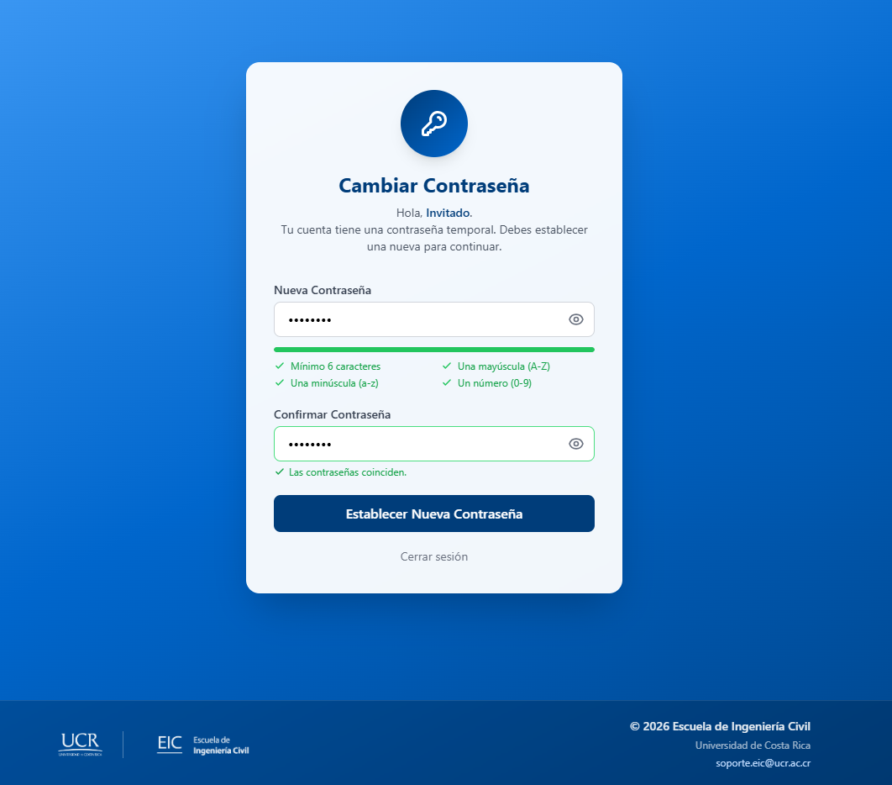
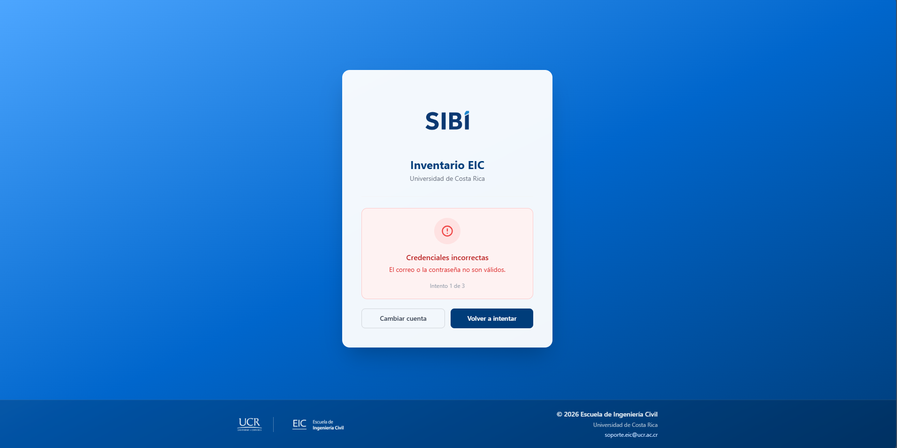
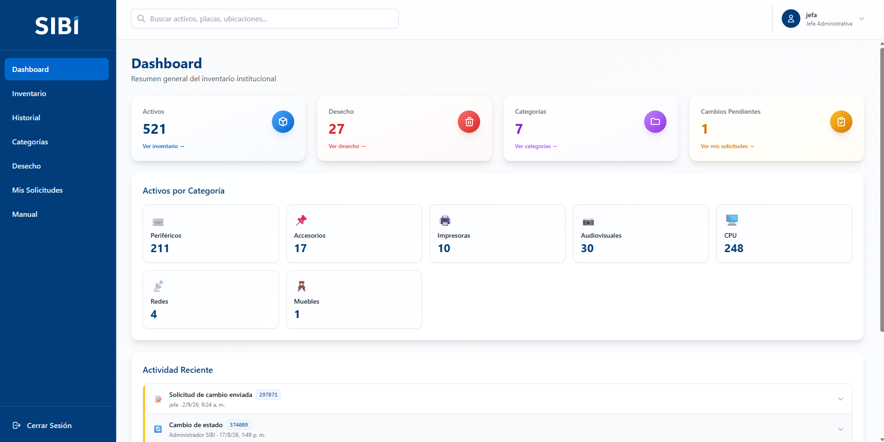
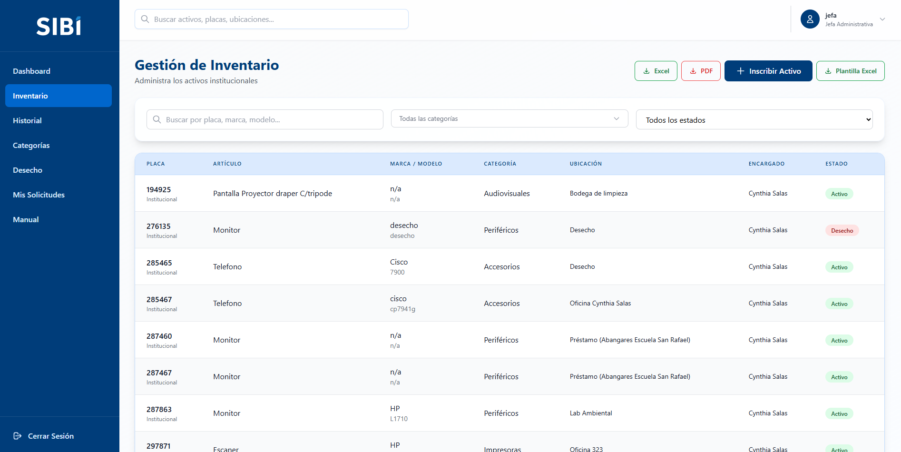
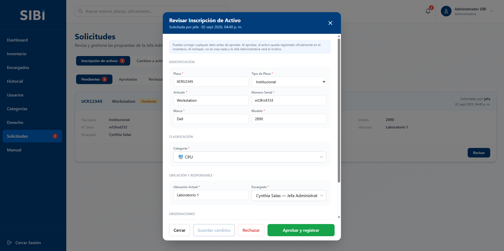
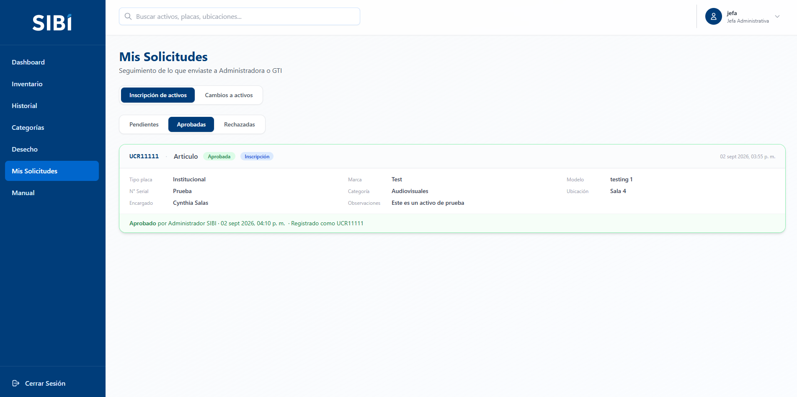
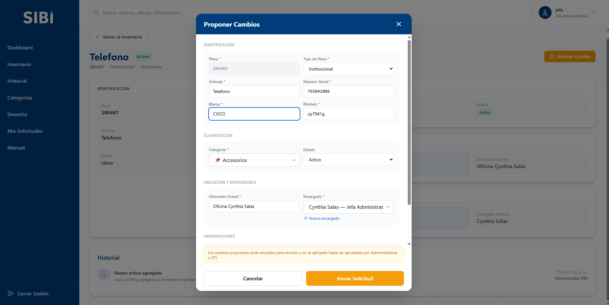
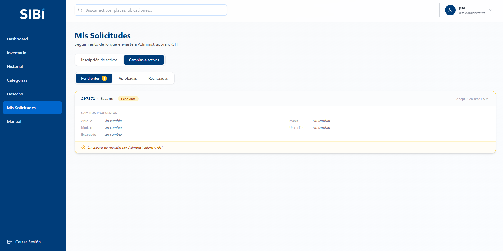
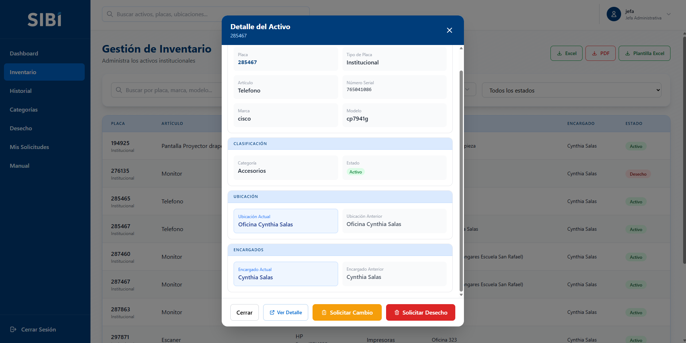

# Manual de Usuario — Rol Jefa Administrativa

**Sistema SIBI — Inventario de Bienes Institucionales, EIC-UCR**

Este manual es para personas con rol **JefaAdministrativa**. Tu rol **no edita los activos existentes directamente ni los da de alta de forma inmediata**: en su lugar, **propones** los cambios y las altas mediante solicitudes que GTI o Administración deben revisar y aprobar (o rechazar, o corregir) antes de que tengan efecto real. En concreto:

- Para **modificar** un activo existente → una **solicitud de cambio**.
- Para **registrar un activo nuevo** → una **solicitud de inscripción**, que llenas **uno por uno** con el botón "Inscribir Activo". No puedes cargar el Excel completo tú misma/o (sí puedes descargar la plantilla para entregarla a quien haga cargas masivas).

Esto existe como control de calidad sobre la información del inventario.

---

## Resumen rápido: qué puedes y qué no puedes hacer

| Acción | ¿Puedes hacerlo? |
|---|:---:|
| Ver Dashboard, inventario, categorías, Desecho | ✅ |
| Ver vista rápida y página de detalle completo de un activo | ✅ |
| Ver historial / auditoría | ✅ |
| Crear un activo individual de forma inmediata | ❌ (lo inscribes con una solicitud que otra persona aprueba) |
| Inscribir un activo nuevo (uno a uno, queda pendiente de aprobación) | ✅ (botón "Inscribir Activo") |
| Importar activos en bloque (Excel/CSV) | ❌ (preparas el archivo, otra persona lo sube) |
| Descargar la plantilla de Excel | ✅ |
| Exportar el inventario (Excel/PDF) | ✅ |
| Editar un activo existente directamente | ❌ (requiere solicitud de cambio) |
| Cambiar la placa de un activo | ❌ |
| Solicitar un cambio sobre un activo | ✅ |
| Solicitar el envío de un activo a Desecho | ✅ |
| Aprobar o rechazar solicitudes de cambio o de inscripción (propias o ajenas) | ❌ |
| Recuperar un activo desde Desecho o aprobar su eliminación definitiva | ❌ |
| Eliminar un activo recién creado (&lt;10 min) | ⚠️ En la práctica no aplica: no creas activos directamente (los inscribes y otra persona los aprueba) |
| Crear encargados nuevos | ✅ (directo en una solicitud de cambio; **propuesto** en una inscripción de activo) |
| Proponer una categoría nueva | ✅ (dentro de una inscripción de activo; se crea solo si la aprueban) |
| Editar, eliminar o reasignar encargados | ❌ |
| Crear, editar o eliminar categorías directamente | ❌ |
| Acceso a la sección de Usuarios del sistema | ❌ |
| Cambiar tu propia contraseña (voluntario, con la actual) | ✅ |

---

## 1. ¿Qué puedes hacer con este rol?

- Ver el Dashboard, el inventario completo y el detalle de cada activo.
- Ver el historial/auditoría del sistema.
- **Inscribir activos nuevos, uno por uno**, con el botón "Inscribir Activo" (ver punto 5). Cada inscripción genera una **solicitud de inscripción** que queda pendiente hasta que GTI o Administración la apruebe, la corrija o la rechace.
- **Descargar la plantilla de Excel** para reunir datos de activos y entregársela a quien sí puede hacer cargas masivas (tú no subes ese archivo).
- Exportar el inventario a Excel o PDF.
- Crear encargados nuevos (por ejemplo, al proponer un cambio o al inscribir un activo).
- **Proponer cambios** sobre un activo existente (marca, modelo, número de serie, artículo, categoría, observaciones, ubicación, encargado o estado) mediante una **solicitud de cambio**, que queda pendiente hasta que sea revisada.
- **Solicitar el envío de un activo a Desecho** con un botón dedicado, independiente de la solicitud de cambio general.
- Ver el estado de tus propias solicitudes (de cambio y de inscripción), pendientes, aprobadas o rechazadas, en la sección "Mis Solicitudes" (usa el selector "Inscripción de activos / Cambios a activos").
- Ver la lista de activos en Desecho (solo lectura).
- Consultar el menú **"Manual"** dentro del sistema, que resume lo que tu rol puede hacer.

## 2. Lo que NO puedes hacer

- **No puedes registrar un activo de forma inmediata.** El botón que usas se llama **"Inscribir Activo"** y crea una solicitud: el activo no aparece en el inventario hasta que GTI o Administración la apruebe. Tampoco tienes "Importar Excel" — solo puedes descargar la plantilla y entregarla a quien haga cargas masivas (ver punto 5).
- **No puedes editar un activo directamente.** Cualquier cambio a un activo ya existente debe pasar por una solicitud de cambio.
- No puedes cambiar la placa de un activo.
- No puedes aprobar ni rechazar solicitudes de cambio ni de inscripción (ni siquiera las tuyas); esa revisión la realiza otra persona con los permisos correspondientes.
- No puedes aprobar ni rechazar bajas de Desecho.
- No puedes gestionar categorías (crear/editar/eliminar) por tu cuenta. Sí puedes **proponer** una categoría nueva dentro de una inscripción de activo (se crea solo si la aprueban); para editar o borrar categorías, contacta a un administrador.
- No puedes editar, eliminar ni reasignar encargados — para corregir uno ya existente o reasignar activos en bloque, contacta a un administrador. Sí puedes **proponer** un encargado nuevo dentro de una inscripción, y **crear** uno directamente desde el formulario de una solicitud de cambio.
- No tienes acceso a la sección de Usuarios del sistema.
- No recibes notificaciones push en tiempo real ni un contador automático de solicitudes: debes revisar "Mis Solicitudes" manualmente para ver si tus solicitudes de cambio o de inscripción ya fueron resueltas.

---

## 3. Iniciar sesión y primer acceso

*Pantalla de inicio de sesión.*

1. Ingresa con tu correo institucional (`@ucr.ac.cr`) y tu contraseña.
2. Si tu cuenta es nueva o alguien te restableció la contraseña, usarás una contraseña temporal que te habrán comunicado directamente (no llega por correo automático todavía). Al ingresar con ella, el sistema te va a obligar a cambiarla (pantalla "Cambiar Contraseña") antes de dejarte usar cualquier otra pantalla — solo debes escribir y confirmar la nueva.
3. La contraseña nueva debe cumplir 4 requisitos que la pantalla marca en verde a medida que los completas: mínimo 6 caracteres, una mayúscula, una minúscula y un número.

   
   *Pantalla "Cambiar Contraseña" del primer ingreso: el botón se habilita cuando los 4 requisitos están en verde y las contraseñas coinciden.*
4. Si te equivocas de contraseña, el login muestra "Credenciales incorrectas" con un contador ("Intento X de 3"). Al tercer intento fallido tu cuenta se bloquea automáticamente. Deberás pedir que un administrador del sistema te la desbloquee.

   
   *Mensaje tras un intento fallido, con el contador "Intento 1 de 3".*
5. El enlace "¿Olvidaste tu contraseña?" **no genera una clave nueva automáticamente**: es una pantalla informativa que indica escribir a soporte.eic@ucr.ac.cr o contactar a un administrador para que te restablezcan el acceso manualmente.
6. **Cambio de contraseña voluntario**: en cualquier momento (sin estar bloqueada ni con contraseña temporal) puedes abrir el menú de tu perfil, arriba a la derecha, y elegir "Cambiar contraseña". A diferencia del cambio forzado del primer ingreso, aquí el sistema sí te pide la contraseña actual, además de la nueva y su confirmación.

---

## 4. Dashboard

Verás tarjetas resumen (total de activos, en desecho, categorías) y una tarjeta especial de **"Solicitudes Pendientes"** que cuenta tus solicitudes **de inscripción y de cambio** aún sin resolver y te lleva directo a "Mis Solicitudes".

*Dashboard: la tarjeta de solicitudes pendientes enlaza a "Mis Solicitudes"; en el menú lateral aparece "Mis Solicitudes". (En la captura la tarjeta aún se llamaba "Cambios Pendientes".)*

---

## 5. Paso a paso: cómo registrar activos nuevos

Tienes dos vías, según sea un activo puntual o un lote.

*Inventario: arriba a la derecha, los botones "Inscribir Activo" y "Plantilla Excel" (no hay "Importar Excel").*

### 5.1 Un activo a la vez: "Inscribir Activo"

1. Ve a "Inventario" y haz clic en **"Inscribir Activo"** (arriba a la derecha).
2. Se abre el formulario **"Inscribir Activo"**, con los mismos campos que usa cualquiera para crear un activo, en cuatro bloques:

   
   *Formulario "Inscribir Activo". El botón de envío dice "Enviar Solicitud".*
   - **Identificación**: Placa* (máx. 8 caracteres), Tipo de Placa* (Institucional o Interno), Artículo* (máx. 20), N° Serial* (máx. 30), Marca* (máx. 30), Modelo* (máx. 20).
   - **Clasificación**: Categoría* — búscala en el selector. Si la que necesitas **no existe**, haz clic en **"Proponer categoría nueva"** (justo debajo del selector), escribe el nombre y, si quieres, un emoji. Queda marcada como *"· nueva (a aprobar)"*: la categoría **no se crea todavía**, se crea solo si GTI o Administración aprueba la inscripción.
   - **Ubicación y Responsable**: Ubicación Actual* (texto libre, máx. 30) y Encargado* — búscalo en el selector, o usa **"Proponer encargado nuevo"** (nombre y cargo/rol). Igual que la categoría, se crea solo al aprobar la inscripción.
   - **Observaciones** (opcional, hasta 200 caracteres).
3. Haz clic en **"Enviar Solicitud"**: se abre una pantalla de revisión con todos los datos agrupados. Si algo está mal, usa "Editar"; si todo está correcto, confirma.
4. La inscripción queda **pendiente de aprobación**. El activo **todavía no aparece** en el inventario (ni la categoría/encargado que hayas propuesto). GTI o Administración la revisará y podrá **aprobarla** (ahí sí se registra el activo, y se crea lo que hayas propuesto), **corregir algún dato antes de aprobar** —incluido cambiar tu propuesta por una categoría/encargado que ya exista—, o **rechazarla** con un motivo.

   
   *Así ve tu inscripción quien la revisa: todos los campos son editables, y decide con "Aprobar y registrar", "Rechazar" o "Guardar cambios".*
5. Puedes seguir el estado en **"Mis Solicitudes"** → selector **"Inscripción de activos"**. Cuando esté "Aprobada" verás con qué placa quedó registrada; si está "Rechazada", verás el motivo para corregir y volver a inscribirla.

   
   *"Mis Solicitudes" → "Inscripción de activos": una inscripción aprobada muestra "Aprobada" y "Registrado como &lt;placa&gt;".*

Notas:
- No puedes tener dos inscripciones pendientes con la misma placa a la vez.
- Si mientras tu solicitud estaba pendiente alguien más registró un activo con esa placa, al intentar aprobarla el sistema la bloqueará y habrá que ajustarla o rechazarla.

### 5.2 Muchos activos: la plantilla de Excel

Para lotes grandes **no** subes el archivo tú misma/o: reúnes los datos y los entregas a quien haga cargas masivas.

1. En "Inventario" haz clic en **"Plantilla Excel"**. Se abre una ventana con instrucciones y las columnas exactas: `Placa, Tipo Placa, Artículo, Marca, Modelo, N° Serial, Categoría, Ubicación Actual, Encargado, Observaciones`.
2. Haz clic en **"Descargar plantilla (.xlsx)"** para bajar el archivo vacío.
3. Completa **una fila por activo**, sin modificar ni eliminar los encabezados. El campo Tipo Placa debe ser `Institucional` o `Interno`/`Interna`. Para Categoría y Encargado usa nombres que ya existan en el sistema si es posible; si falta una categoría, pide a un administrador que la cree antes.
4. Entrega el archivo completado a quien pueda cargarlo. Esa persona verá una vista previa con errores o datos ambiguos antes de confirmar, así que puede que te pidan corregir algo y reintentar.

También tienes los botones "Excel"/"PDF" en Inventario para exportar el listado filtrado, que sí son de uso directo tuyo.

---

## 6. Cómo proponer un cambio sobre un activo existente

Este es el flujo central de tu rol:

1. Ve al inventario, busca el activo (por placa, marca, modelo, etc.) y ábrelo (clic sobre la fila abre una vista rápida).
2. En la vista rápida verás dos botones específicos para tu rol: **"Solicitar Cambio"** (ámbar) para proponer modificaciones a sus datos, y **"Solicitar Desecho"** (rojo, ver más abajo) si lo que necesitas es enviarlo a Desecho. Ninguno de los dos aparece si el activo ya está en Desecho o si ya tienes una solicitud pendiente sobre él.
3. En "Solicitar Cambio" completas los campos que quieres modificar (marca, modelo, categoría, ubicación, encargado, estado, observaciones, etc.).

   
   *Formulario "Proponer Cambios". El aviso recuerda que los cambios no se aplican hasta ser aprobados.*
4. Al enviar la solicitud, queda en estado **Pendiente**. El sistema notifica automáticamente en tiempo real a quienes pueden revisarla (tú no recibes confirmación push, solo queda registrada).
5. El activo **no cambia todavía** — solo se actualizará si la solicitud es aprobada.
6. Si el activo ya tiene una solicitud tuya pendiente, el sistema te lo indicará al abrirlo, para evitar que envíes solicitudes duplicadas o contradictorias sobre el mismo bien.

### Solicitar el envío a Desecho

Si lo único que necesitas es que un activo pase a estado Desecho (sin proponer ningún otro cambio), usa el botón dedicado **"Solicitar Desecho"** en vez de "Solicitar Cambio". Genera una solicitud simplificada que solo contiene el cambio de estado; en "Mis Solicitudes" se muestra con una etiqueta y borde rojo distintivos, y con una tarjeta "Activo a desechar" en lugar de la comparación de campos. Sigue el mismo flujo de aprobación: el activo solo pasa a Desecho si quien la revisa la aprueba.

### Seguimiento: "Mis Solicitudes"

En el menú "Mis Solicitudes" puedes ver todo lo que has enviado. Arriba hay un selector **"Inscripción de activos / Cambios a activos"** para alternar entre tus solicitudes de alta y tus solicitudes de cambio; debajo, las pestañas por estado:

- **Pendiente**: todavía no ha sido revisada.
- **Aprobada**: para un cambio, ya se aplicó al activo real; para una inscripción, el activo ya quedó registrado (verás con qué placa).
- **Rechazada**: no se aplicó. Si quien la revisó dejó un comentario, lo verás ahí — úsalo para corregir y, si corresponde, enviar una nueva solicitud con los datos correctos.

*"Mis Solicitudes" → "Cambios a activos": una solicitud de cambio pendiente de revisión.*

Como no recibes notificaciones push, esta es la pantalla que debes revisar manualmente para saber si ya resolvieron tus solicitudes.

---

## 7. Consultar el inventario, Desecho, categorías y el historial

Puedes buscar y filtrar el inventario completo (por texto, categoría o estado) y ver el detalle completo de cualquier activo, incluyendo su ubicación actual/anterior y su encargado actual/anterior.

La vista rápida se abre con un clic sobre la fila; el botón "Ver Detalle" abre la página completa, que además muestra la ubicación y el encargado anteriores y el historial del propio bien.

*Vista rápida de un activo: los botones "Solicitar Cambio" y "Solicitar Desecho" son los específicos de tu rol.*

También puedes ver, en **modo solo lectura**, la lista de activos en **Desecho** (con su barra de progreso hacia los 365 días) y el catálogo de **Categorías** con sus activos — sin botones de acción en ninguna de las dos.

Tienes acceso al **historial de auditoría** completo, con filtros por persona usuaria, tipo de acción y rango de fechas. Es la forma de verificar que tu solicitud ya se aplicó: una inscripción aprobada aparece como una entrada **"Creación"** que menciona que fue "alta solicitada por …, aprobada por …".

*Historial: filtros por tipo de acción, usuario y fechas; cada entrada enlaza al detalle del activo. (El menú lateral varía según el rol.)*

---

## 8. Limitaciones a tener en cuenta (resumen)

- No das de alta activos de forma inmediata: los **inscribes** uno por uno (queda pendiente de aprobación) y para lotes solo preparas la plantilla para que otra persona la cargue.
- Tanto los cambios como las inscripciones pasan por un proceso de aprobación — planifica tiempo para eso, no es instantáneo.
- No puedes crear categorías nuevas (sí puedes crear encargados); si te falta una categoría para completar una inscripción, la plantilla o una solicitud de cambio, pide que la creen antes de continuar.
- No tienes un menú "Encargados" propio para administrarlos en bloque — la creación de un encargado nuevo solo está disponible como paso rápido dentro del formulario de una solicitud (de cambio o de inscripción).
- No puedes deshacer una solicitud ya enviada ni "cancelarla" tú misma/o una vez pendiente — si te equivocaste, contacta a quien la vaya a revisar para que la rechace (o la corrija, en el caso de una inscripción), y luego envía una nueva correcta.
- No hay aviso automático cuando resuelven tus solicitudes: revisa "Mis Solicitudes" periódicamente.

---

## 9. Preguntas frecuentes y errores comunes

**"No encuentro el botón para editar un activo."**
Es correcto: tu rol no tiene edición directa. En la vista rápida del activo busca los botones **"Solicitar Cambio"** o **"Solicitar Desecho"** — son tu forma de proponer modificaciones.

**"Envié una solicitud y no aparece el botón para enviar otra sobre el mismo activo."**
El sistema no permite tener dos solicitudes de cambio pendientes a la vez sobre el mismo activo, para evitar propuestas contradictorias. Espera a que la primera se resuelva (revisa "Mis Solicitudes") antes de enviar otra.

**"Inscribí un activo y no lo veo en el inventario."**
Es correcto: una inscripción queda **pendiente de aprobación**. El activo solo aparece cuando GTI o Administración la aprueba. Mira el estado en "Mis Solicitudes" → "Inscripción de activos". Si sale "Rechazada", revisa el motivo, corrige e inscríbelo de nuevo.

**"Al inscribir un activo me dice que ya existe una solicitud pendiente para esa placa, o que la placa ya existe."**
No puede haber dos inscripciones pendientes con la misma placa, y tampoco puedes inscribir una placa que ya está en el inventario. Verifica el número; si el activo ya existe, no hay que inscribirlo.

**"Inscribí un activo pero GTI/Administración cambió algunos datos antes de aprobarlo."**
Es una función prevista: quien revisa puede corregir cualquier dato de la inscripción antes de aprobarla (por ejemplo, ajustar la categoría o el encargado). El activo queda registrado con los datos ya corregidos.

**"Mi solicitud lleva días en 'Pendiente' y no sé si alguien la va a revisar."**
No recibes ninguna notificación automática cuando la revisan: tienes que consultar "Mis Solicitudes" tú misma/o. Si es urgente, contacta directamente a un administrador para pedir que la revisen.

**"Mi solicitud fue rechazada, ¿qué hago?"**
Revisa el comentario que haya dejado quien la rechazó (aparece en "Mis Solicitudes", debajo de la solicitud resuelta) — normalmente explica qué corregir. Corrige los datos y envía una solicitud nueva; la rechazada no se puede reabrir ni editar.

**"No encuentro el botón 'Importar Excel' en Inventario."**
Es correcto: tu rol no puede subir el archivo. Tienes en cambio **"Inscribir Activo"** (para altas de uno en uno) y **"Plantilla Excel"** (para descargar el archivo vacío y entregarlo a quien haga cargas masivas).

**"Llené la plantilla con una categoría que todavía no existe, ¿qué hago?"**
Para la **plantilla masiva**: no puedes crear categorías, así que pide a un administrador que la agregue antes de entregar el archivo (o dilo al entregarlo). Al **inscribir un activo individual** sí puedes usar **"Proponer categoría nueva"**: se crea si aprueban la inscripción.

**"Entregué la plantilla y no sé si ya se cargó al inventario."**
Tu rol no recibe ningún aviso automático de esto. Consulta el inventario buscando la placa del activo, o pregunta directamente a quien se encargó de subirla.

**"No veo el botón 'Solicitar Cambio' en un activo."**
No aparece si el activo ya está en estado Desecho, o si ya tienes una solicitud pendiente sobre él.

---

## 10. ¿A quién acudir?

- Para que se apruebe o rechace una solicitud con urgencia, o para que se cree una categoría que necesitas, contacta directamente a un administrador del sistema.
- Para dudas sobre el uso del sistema, tu contraseña, o cualquier problema técnico, puedes escribir a **soporte.eic@ucr.ac.cr**.
